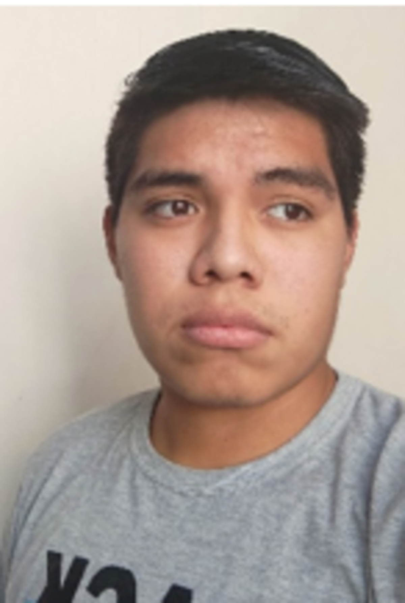
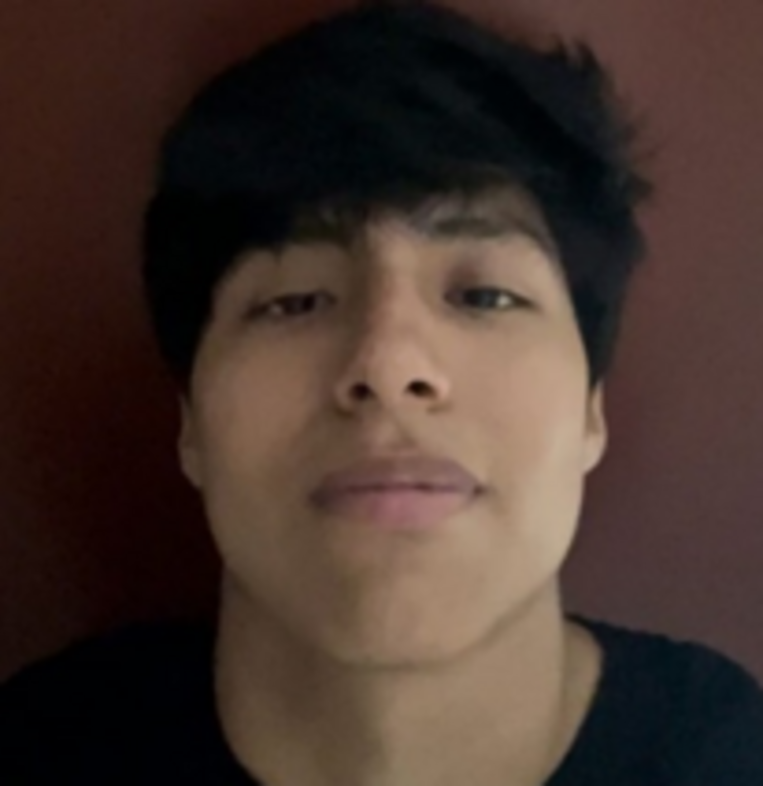

|  |
**Marco Collantes Artola (u201410183)**

*Ingeniería de Software*

Me considero bueno trabajando en equipo dando apoyo y asesoría cuando se necesita aplicar el ir un paso a la vez a la hora de desarrollar proyectos. Soy bueno a la hora de trabajar en programas como el Visual Studio, WebStorm, Word y Excel con notas y trabajos satisfactoriamente exitosos. Disfruto mucho de investigar sobre nuevos temas y soy fanático acérrimo del cine y la buena música.
|
|:----------------------------------------| :- |

|  |
**Leonardo Taype Fernandez (u20201e840)**

*Ingeniería de Software*

Me considero una persona proactiva y responsable. Tengo conocimientos en lenguajes de programación como Python, C#, C++. Me gusta trabajar en equipo y apoyar a mis compañeros.
|
|:----------------------------------------------| :- |

|  |
**Jack Arana Ramos (u202121875)**

*Ingeniería de Software*

Me considero una persona autodidacta, capaz de realizar los trabajos de manera eficaz y eficiente. Además, tengo buena relación con los trabajos en equipo y cuento con algunas habilidades tales como: el lenguaje C + +, HTML, CSS y algunos conceptos básicos del Desarrollo Web.
|
|:--------------------------------------| - |

|  |
**André Alonso Arroyo Ormeño (u202114714)**

*Ingeniería de Software*

Soy estudiante de 5to ciclo en la carrera de Ingeniería de Software en la UPC. Me considero una persona responsable, estudiosa y disciplinada. Poseo conocimientos en lenguajes como C + +, Python y en cuanto al desarrollo web dominio HTMLS y CSS Desde pequeño siempre he tenido ese interés por la tecnología y dicha curiosidad me ha llevado a elegir esta carrera. Espero en el futuro adquirir los conocimientos necesarios de esta carrera para poder vivir de lo que me gusta.
|
|:----------------------------------------| - |

|  |
**Paolo Sebastián Padilla Advincula(u202117993)**

*Ingeniería de Software*

Como estudiante de la carrera de Ingeniería de Software, apoyaré al equipo con mis conocimientos fuera y dentro de la universidad. Esto brindará un desarrollo óptimo durante el campo estudiantil.
|
|:----------------------------------------| :- |
