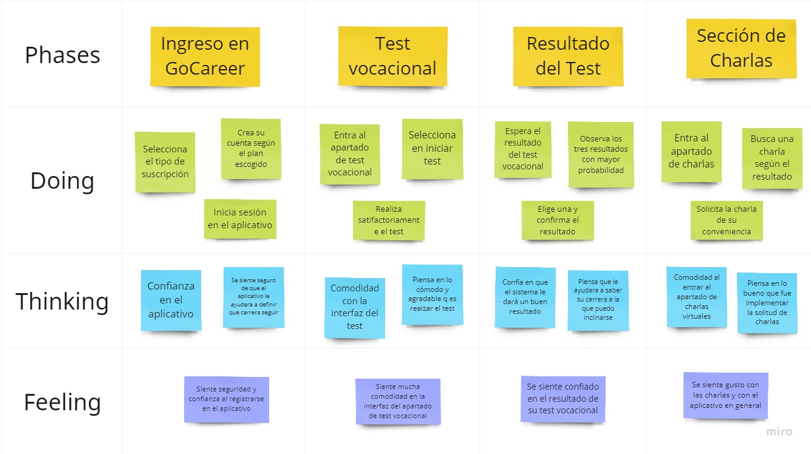

# **CAPÍTULO III: REQUIREMENTS**

La sección de Especificación de Requisitos desempeña un papel crucial en el proceso de desarrollo de productos digitales. Esta etapa permite al equipo transformar la información recopilada durante las investigaciones en una descripción detallada de los requisitos esenciales para los productos digitales en cuestión. Comenzaremos por ofrecer una descripción que establece el contexto y la importancia de cada fase. Luego, profundizaremos en los aspectos clave del proceso, que incluye el Mapeo de Escenarios Futuros, la creación de Historias de Usuario, la elaboración del Mapa de Impacto y la confección del Backlog del Producto. Cada uno de estos elementos contribuirá de manera significativa a la definición precisa de los objetivos y las funcionalidades que se esperan en los productos digitales que se están desarrollando.

## **3.1. To-Be Scenario Map**

En esta parte, expondremos los "To-Be Scenario Map" para cada segmento objetivo segun nuestros User Personas clave: Angie Agama y Sofia Zuñiga. Estos mapas representan las situaciones actuales y las vivencias de ambas personas en sus respectivos contextos. Donde se plasmará la experiencia de usuario ideal, una vez que se hayan abordado los puntos de insatisfacción y necesidades identificados en los "As-Is Scenario Map". La herramienta digital utilizada para la creación de ambos escenarios ha sido Miro.

### Usuario Estudiante / Desempleado 

### Usuario Especialista

