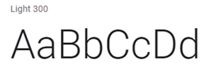
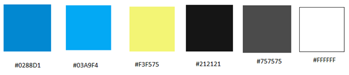

**4.1.1. General Style Guidelines.**

Tipografía: 

La tipografía utilizada se enfoca en dar una vista agradable al usuario, que se adapte al entorno digital de forma simple. También, proporciona seguridad y confianza al usuario al ser tipografías mayormente usadas en sitios educativos. La fuente predominante en la web será “Roboto”, la cual se usará para textos de explicación o descripción de funcionalidades. Por otro lado, la fuente “Open Sans” será usada para redactar los titulares o información importante. De esta manera logramos un equilibrio en la densidad del contenido de nuestra página y lograr que nuestro usuario no tenga problemas al leer el sitio web.

Roboto

Open Sans

Colores: 

El color es uno de los apartados más importante al crear una aplicación o página web. Es por ello que en nuestro proyecto se usarán diferentes tonalidades de color azul y celeste, los cuales transmiten seguridad y confianza, además de ser reductores de estrés. Ambos colores afirman lo que buscamos con nuestro proyecto. Asimismo, también encontramos colores en específico para ciertos componentes dentro de la aplicación; y también, definimos una tonalidad de negro y blanco para diferentes textos dentro de la misma.

Lenguaje: 

Para el desarrollo del frontend de la aplicación se decidió utilizar una combinación de lenguaje formal para los elementos relacionados a los datos de los usuarios, y también de un lenguaje entusiasta para motivar al usuario para emplear diferentes componentes dentro de la aplicación.

