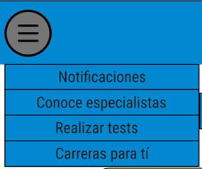

**4.2.5. Navigation Systems.**

La principal herramienta para la navegación de los usuarios será un menú desplegable como parte de la barra de herramientas principal, el cuál dispondrá a los usuarios de diferentes opciones relacionadas a diferentes ventanas de la misma. Este menú estará disponible en casi todas las ventanas de la aplicación, permitiendo así un gran nivel de exploración de la misma.

En caso de querer regresar a la ventana principal, la barra de herramientas de la parte superior contará con el logo de la aplicación que servirá como punto de acceso a la misma. Esta barra también contará con un acceso directo a una ventana de acceso al perfil de usuario, que puede ser usado como punto de retorno desde cualquier ubicación de la app.

