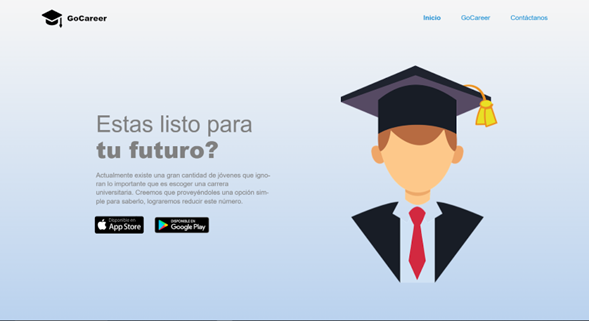
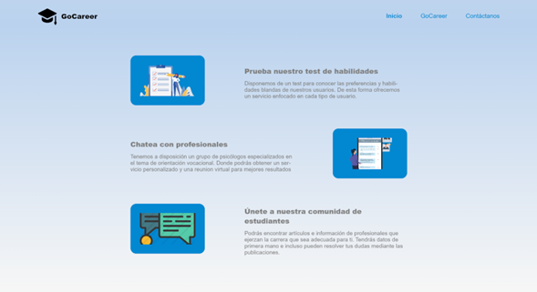

**4.3.2. Landing Page Mock-up.**

A continuación, procedemos a mostrar los mock-up correspondientes al landing page de la aplicación:

Comenzamos con un vistazo en general del landing page con la vista de Inicio, también se desplegarán las opciones de acceso a la aplicación:

La vista de GoCareer presentará las diferentes funciones de la aplicación para el usuario, en forma de resúmenes agradables de ver:

La vista Contactanos nos permitirá comunicarnos con nuestros posibles usuarios por medio de correos y mostrará las opciones de contacto como nuestras redes sociales:

