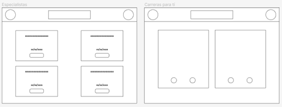

**4.4.1. Web Applications Wireframes.**

A continuación, definimos los diferentes wireframes de nuestra aplicación web desarrolladas principalmente en Figma (ver anexos).

Wireframes correspondientes a las interfaces de registro de usuario e ingreso de usuarios registrados:

Wireframes correspondientes a la interfaz de recuperación de contraseña, la ventana principal del usuario estudiante y su menú de opciones (detalles pendientes de corrección):

Wireframes del perfil del usuario en la app, las opciones de pago del usuario y las notificaciones disponibles:

Wireframes para la ventana de test para usuarios, de un test abierto y disponible y resultados de los test:

Wireframes de las reuniones disponibles para usuarios y recomendaciones de carreras:

Wireframes de la ventana principal de los especialistas, listado de usuarios que atienden con él y la ventana con los test que debe calificar:

Wireframes de la ventana principal del especialista con su menú desplegado y ventana de reuniones agendadas para especialistas:

