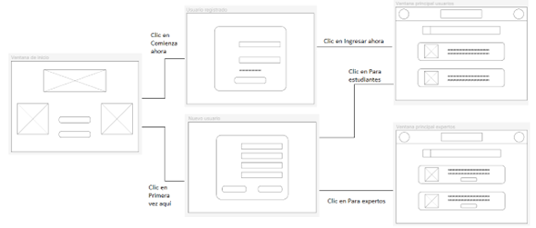
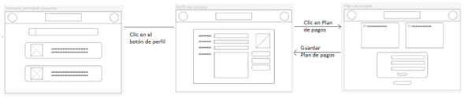
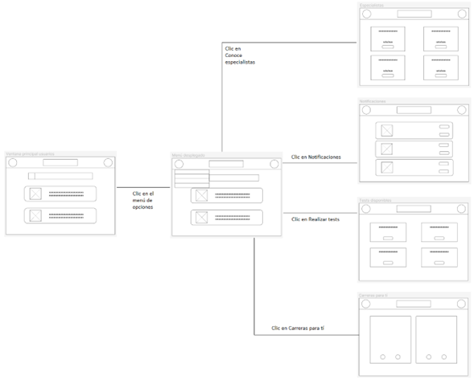
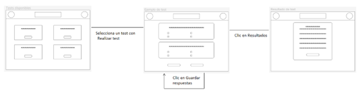
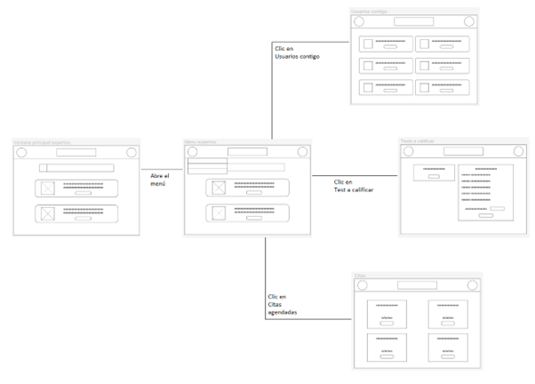

**4.4.2. Web Applications Wireflow Diagrams.**

**User Goal: El usuario ingresa a la aplicación para registrarse**

El usuario, sea un estudiante o un especialista, obtiene acceso a la página por medio del landing page y es redirigido a una ventana de inicio para el usuario. Una vez dentro, se le dan las opciones de entrar con el botón “Comienza ahora” para usuarios ya registrados y el botón “Primera vez aquí”, para los no registrados. Tras hacer clic en la segunda opción, se abrirá un formulario para registrarse dentro de la página y finalizar el proceso mediante botones denominados “Para expertos” y “Para estudiantes” para entrar a su respectiva pantalla de inicio. Independientemente de su condición de usuario, la primera opción permitirá entrar a su respectiva pantalla de inicio con solo ingresar sus datos. 

**User Goal: Recuperación de contraseña**

En el caso de que un usuario, especialista o estudiante, no pueda recordar su contraseña, el formulario de entrada ofrece una opción para crear una nueva contraseña por medio de un nuevo formulario. En el nuevo formulario, podrá ingresar una nueva contraseña y confirmar para después entrar en su cuenta con la contraseña modificada.

**User Goal: El usuario desea acceder a su perfil para modificar su información personal**

**User Goal: El usuario desea cerrar su sesión en la plataforma**

**User Goal: El usuario desea elegir o cambiar su plan de pagos**

Las diferentes pantallas de la aplicación constan de un botón para acceder a su perfil de usuario, situado en la esquina superior derecha de la pantalla. La ventana del “Perfil de usuario” consta de varios cuadros que pueden ser habilitados con el botón “Cambiar datos” para modificar la información personal del usuario y después guardarlos. Para manejar sus pagos en la aplicación, el sistema dispone de un botón llamado “Plan de pagos” que redirigirá al usuario a una página donde podrá elegir el plan más acorde a sus necesidades y con un formulario especial para registrar una tarjeta de crédito/débito a su nombre. Una vez guardados estos datos, el usuario puede hacer clic en “Guardar plan de pagos” para regresar a su perfil y de ahí regresar a cualquiera de las opciones de la página, incluída la opción para cerrar su perfil con el botón “Cerrar sesión” incluido en el perfil. 

**User Goal: El usuario desea acceder a la aplicación para atender a reuniones con especialistas**

**User Goal: El usuario revisa las notificaciones de su cuenta en la aplicación**

**User Goal: El usuario desea realizar los test disponibles para él**

**User Goal: El usuario quiere conocer qué carreras son recomendables para él**

La ventana de inicio de los usuarios estudiantes cuenta con un menú desplegable que le brinda acceso a diferentes funciones para él o ella dentro del sistema. Con la opción de “Realizar test”, se le redireccionará a la página donde podrá acceder a los test disponibles para él; en “Notificaciones”, una ventana con las nuevas actualizaciones de la página y sus carreras recomendadas; en “Conoce especialistas”, diferentes ventanas para reuniones tanto grupales como individuales con especialistas registrados en la app; y en “Carreras para ti”, ventanas que recomendarán carreras que el usuario puede aceptar o rechazar según sus gustos.

**User Goal: El usuario desea realizar un test para conocer sus aptitudes**

Tras presionar la opción “Realizar test”, se le mostrará un usuario una página con diferentes test disponibles para él y que podrá realizar al hacer clic en el botón incluido en ellos. Se le mostrará una serie de preguntas cargadas en el sistema, siendo la mayoría de selección múltiple basado en información consultada o subida por especialistas en la plataforma. Ya sea que haya finalizado o no, puede emplear el botón inferior “Guardar respuestas” para registrar su progreso en el test de cara a una calificación; y en el caso de haber terminado, puede hacer clic en “Resultados” para que se le muestre un resumen de sus respuestas. No todas serán inmediatas, y requerirán que un especialista las revise para entregar un resumen más completo.

**User Goal: El especialista desea seguir el avance de los usuarios registrados con él**

**User Goal: El especialista quiere calificar un test realizado por un usuario**

**User Goal: El especialista desea asistir a una reunión con uno o más usuarios**

En el caso de los especialistas, su menú consta de 3 principales funciones para su labor dentro de la aplicación. Con la opción de “Usuarios contigo”, este podrá revisar a los diferentes estudiantes y/o desempleados que hayan realizado un test o asistido a una reunión donde haya hecho acto de presencia, además de ver sus perfiles y conocer más de ellos; con “Test a calificar”, verá los test a su nombre que fueron respondidos por un usuario y podrá asignar una nota o comentario dependiendo de lo registrado; y en “Citas agendadas”, las diferentes reuniones grupales o personales donde este tendrá que aparecer.

