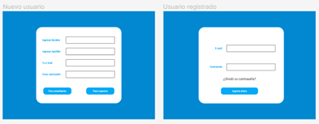
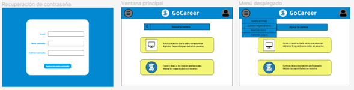
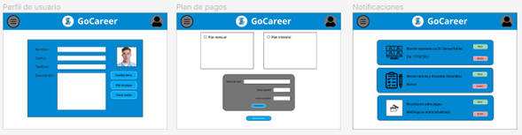
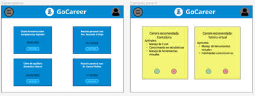
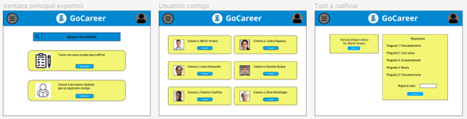

**4.4.3. Web Applications Mock-ups.**

En base a los wireframes presentados en el item anterior, se desarrollaron los siguientes mock-ps de la aplicación.

De izquierda a derecha, tenemos el mock-up de la interfaz de registro del usuario; construida con formularios para los datos como nombre, correo y contraseña y botones que marcan a un usuario como estudiante o especialista; y el mock-up para el ingreso regular del usuario usando solo formularios de correo y contraseña, junto con un enlace en caso de que el usuario olvide su contraseña:

De izquierda a derecha, encontramos el mock-up de la interfaz de recuperación de contraseña con formularios de correo y creación de nuevas contraseñas. También encontramos mock-ups que simulan la apariencia de la ventana principal para los usuarios estudiantes, en donde se pueden apreciar una barra de búsqueda, anuncios de la aplicación y el menú de opciones desplegado: 

Encontramos aquí los mock-ups del perfil del usuario con botones que permiten cambiar el contenido de los formularios de datos, cerrar sesión y acceder a la ventana de planes de pago. La ventana de planes de pago presenta los planes de pago de la start-up junto con una pequeña interfaz para registrar su tarjeta. También encontramos la ventana que muestra tarjetas con notificaciones para el usuario (nuevos tests, recomendaciones de carrera, etc.) con botones para revisar o no:

Los siguientes mock-ups describen el funcionamiento de los test en la aplicación web. Desde la ventana de test disponibles puede seleccionar el de su interés con un solo botón, y abrir la ventana de test correspondiente mostrando las preguntas con las que está programado el test y sus posibles respuestas. El último mock-up de la fila muestra los resultados de forma numérica en base a las respuestas, y los usuarios que pagan pueden también recibir una nota del especialista a cargo del test:

Los últimos mock-ups del usuario corresponden a las ventanas de citas agendadas, cada una con un título o breve descripción y un botón de acceso a reunión, y la ventana de carreras disponibles para el usuario, con título, descripción y botones para marcarlas como interés del usuario. Todas las ventanas presentadas hasta ahora tienen una barra de herramientas con un botón para desplegar el menú y para acceder al perfil de usuario:

Los siguientes mock-ups corresponden a ventanas solo visibles para los usuarios especialistas, con una construcción más pequeña y opciones para acceso rápido desde la ventana principal. Un especialista puede revisar cuantos y cuales fueron los usuarios que llevaron un test suyo o si tuvieron reuniones con él/ella en la ventana central, y en la 3era podrá revisar personalmente las respuestas a test hechos a él y dejar comentarios sobre ello al usuario:

Los últimos mock-up resaltan lo pequeño que son las ventanas del especialista comparado con el estudiante, con un menú con menos opciones pero que ya vimos son más complejas que las otras. En sí el mock-up de reuniones para los especialistas posee la misma estructura que los otros usuarios, aunque es lógico al considerar la finalidad de este apartado para ambos:

Enlace a Figma: <https://www.figma.com/file/YZwPxwSdUdlzOV54VRkfZ1/GoCareer-202302?type=design&node-id=2%3A9&mode=design&t=7L3OwBtR4B2boP1R-1>
