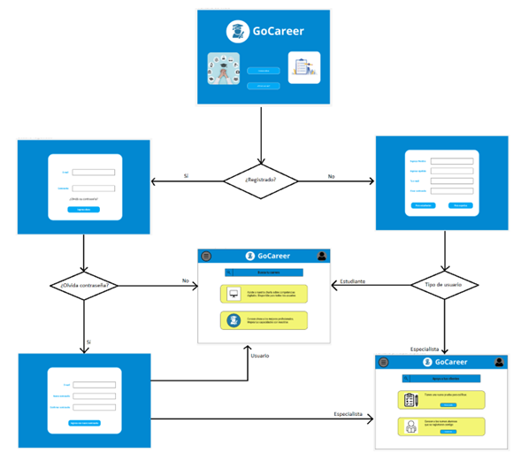
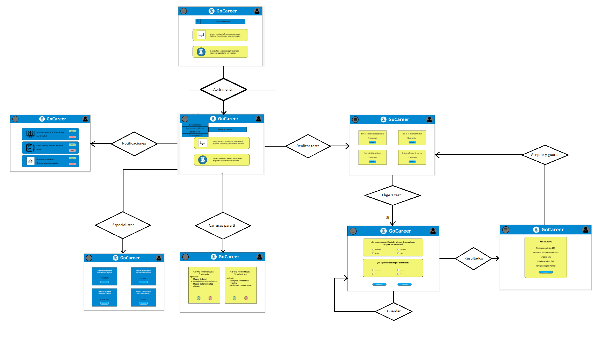
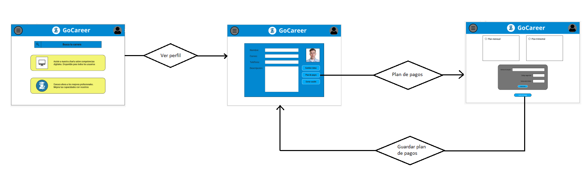

**4.4.4. Web Applications User Flow Diagrams.**

Basado en los Wireflow Diagrams, se han definido los siguientes User Flow Diagrams para nuestro mock-up y prototipo:

**4.5. Web Applications Prototyping.**

Puede acceder al prototipo de nuestra aplicación por medio del siguiente enlace: <https://www.figma.com/proto/YZwPxwSdUdlzOV54VRkfZ1/GoCareer-202302?type=design&node-id=95-621&t=w9P5DaTqxbpL8KGO-1&scaling=scale-down&page-id=2%3A10&starting-point-node-id=95%3A642&mode=design> 

