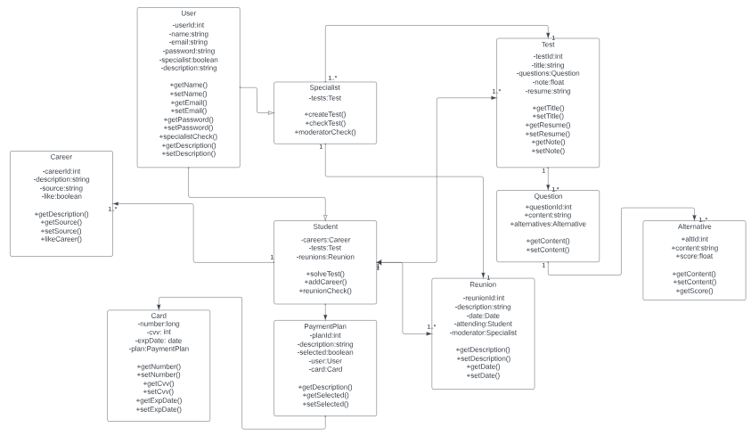

**4.7.1. Class Diagrams.**

En base a las necesidades de nuestro producto, se decidió emplear las clases representadas en este diagrama preliminar:

Cada una de las clases está relacionada a uno o más componentes de nuestro proyecto, con atributos y métodos definidos dentro del apartado Class Dictionary del documento.