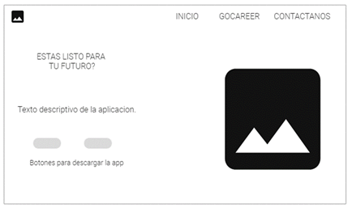
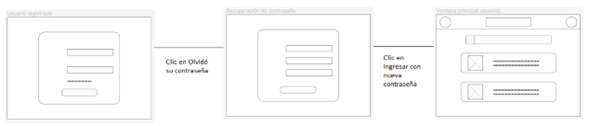
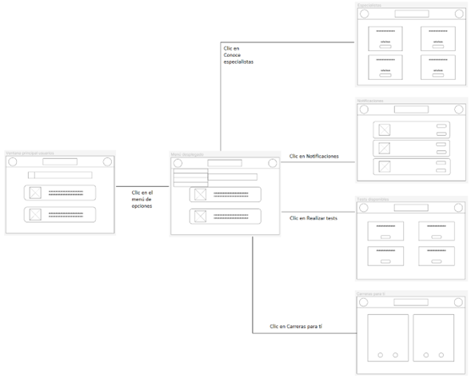
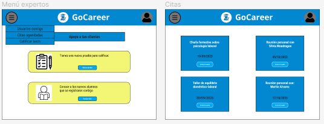
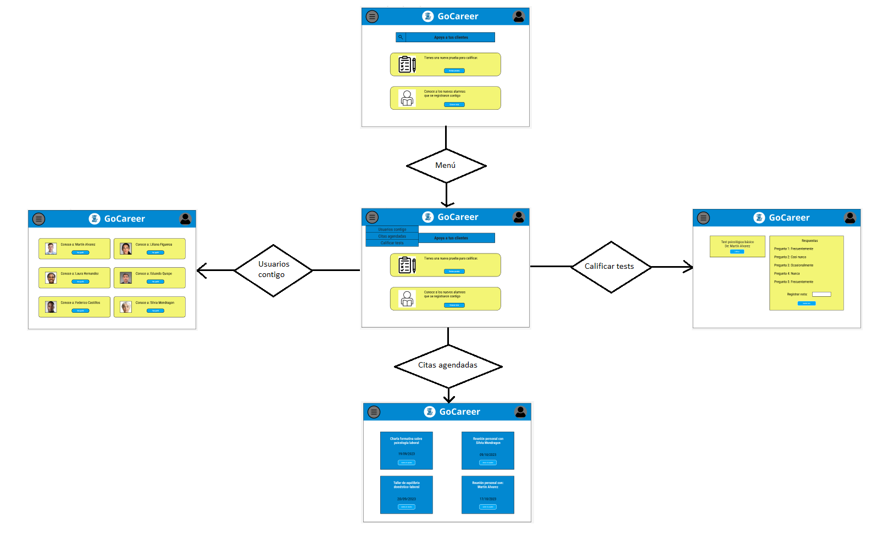

# Carátula

**Universidad:** Universidad Peruana de Ciencias Aplicadas

**Carrera:** Ingeniería de software

**Curso:** Desarrollo de Aplicaciones Open Source

**Sección:** WS51

**Informe de Trabajo Final**

**Profesor:** Angel Augusto Velasquez Nuñez

**Nombre del Startup:** Starsoft

**Nombre del Producto:** GoCareer

**Integrantes:**

- Jack Arana Ramos (u202121875)
- Marco Collantes Artola (u201410183)
- Leonardo Taype Fernandez (u20201e840)
- André Alonso Arroyo Ormeño (u202114714)
- Paolo Sebastian Padilla Advincula ()

**Ciclo:** 2023-02

**Mes:** Setiembre

# Registro de Versiones del Informe

| Versión | Fecha      | Autor           | Descripción de modificación                                                                                         |
|---------|------------|-----------------|---------------------------------------------------------------------------------------------------------------------|
| TB1     | 27/08/2023 | André Arroyo    | Desarrollo del capítulo I: Introducción                                                                             |
| TB1     | 30/08/2023 | Leonardo Taype  | Desarrollo del capítulo II: Competidores                                                                            |
| TB1     | 01/09/2023 | Paolo Padilla   | Desarrollo del capítulo II: Needfinding                                                                             |
| TB1     | 02/09/2023 | Marco Collantes | Registro de la entrevista para el Needfinding                                                                       |
| TB1     | 03/09/2023 | André Arroyo    | Registro de entrevista para el Needfinding                                                                          |
| TB1     | 04/09/2023 | Jack Arana      | Desarrollo del capítulo III: Especificación de Requerimientos                                                       |
| TB1     | 04/09/2023 | Marco Collantes | Desarrollo del capítulo IV: Product Design                                                                          |
| TB1     | 08/09/2023 | Paolo Padilla   | Desarrollo del capítulo IV: Diagram Class                                                                           |
| TB1     | 09/09/2023 | Jack Arana      | Desarrollo del Domain-Driven y del Software Deployment Configuration                                                |
| TB1     | 09/09/2023 | André Arroyo    | Desarrollo del capítulo V: Product Implementation, Validation & Deployment -> 5.1 Software Configuration Management |
| TP1     | 20/09/2023 | Marco Collantes | Correción de items del capítulo 4                                                                                   |
| TP1     | 20/09/2023 | André Arroyo    | Correción de items del capítulo 1                                                                                   |
| TP1     | 21/09/2023 | Jack Arana      | Se corrigio palabras clave de la caratula, registro de versiones y Collaboration Insights                           |
| TP1     | 21/09/2023 | André Arroyo    | Correción items del capitulo V                                                                                      |
| TP1     | 22/09/2023 | Jack Arana      | Se corrigio la información e imagenes del capitulo III y del Domain-Driven                                          |
| TP1     | 22/09/2023 | Leonardo Taype  | Se corrigio la información e imágenes del capitulo II                                                               |
| TP1     | 26/09/2023 | Marco Collantes  | Sprint Planning y Sprint Backlog agregados                                                                          |
| TP1     | 26/09/2023 | Jack Arana  | Se actualizo el formato y estructura de la entrega, al README.md                                                    |
| TP1     | 28/09/2023 | Andre Arroyo  | Capitulo V: Desarrollo del Sprint 1 y 2                                                                             |

# Project Report Collaboration Insights

[Enlace al Repositorio del Informe en GitHub](https://github.com/orgs/StarsoftOrg/repositories)

[Enlace al video de exposición en Microsoft Stream](https://upcedupe-my.sharepoint.com/:v:/g/personal/u202121875_upc_edu_pe/EcNYrH8peyZNhPGExe4u10gB0HbJg7IaObDQx32SG-BZLg)
- [Capítulo I: Introducción](#).
    - [1.1. Startup Profile](#11-startup-profile-a-namestartup-profilea)
        - [1.1.1. Descripción de la Startup](#111-descripción-de-la-startup)
        - [1.1.2. Perfiles de integrantes del equipo](#112-perfiles-de-integrantes-del-equipo)
    - [1.2. Solution Profile](#12-solution-profile)
        - [1.2.1. Antecedentes y problemática](#121-antecedentes-y-problemática)
        - [1.2.2. Lean UX Process](#122-lean-ux-process)
            - [1.2.2.1. Lean UX Problem Statements](#1221-lean-ux-problem-statements)
            - [1.2.2.2. Lean UX Assumptions](#1222-lean-ux-assumptions)
            - [1.2.2.3. Lean UX Hypothesis Statements](#1223-lean-ux-hypothesis-statements)
            - [1.2.2.4. Lean UX Canvas](#1224-lean-ux-canvas)
        - [1.3. Segmentos objetivo](#13-segmentos-objetivo)

- [Capítulo II: Requirements Elicitation & Analysis](#)
    - [2.1. Competidores](#21-competidores)
        - [2.1.1. Análisis competitivo](#211-análisis-competitivo)
        - [2.1.2. Estrategias y tácticas frente a competidores](#212-estrategias-y-tácticas-frente-a-competidores)
    - [2.2. Entrevistas](#22-entrevistas)
        - [2.2.1. Diseño de entrevistas](#221-diseño-de-entrevistas)
        - [2.2.2. Registro de entrevistas](#222-registro-de-entrevistas)
        - [2.2.3. Análisis de entrevistas](#223-análisis-de-entrevistas)
    - [2.3. Needfinding](#23-needfinding)
        - [2.3.1. User Personas](#)
        - [2.3.2. User Task Matrix](#)
        - [2.3.3. User Journey Mapping](#)
        - [2.3.4. Empathy Mapping](#)
        - [2.3.5. As-is Scenario Mapping](#)

- [Capítulo III: Requirements Specification](#capítulo-iii-requirements)
    - [3.1. To-Be Scenario Mapping](#31-to-be-scenario-map)
    - [3.2. User Stories](#32-user-stories)
    - [3.3. Impact Mapping](#33-impact-mapping)
    - [3.4. Product Backlog](#34-product-backlog)

- [Capítulo IV: Product Design](#)
    - [4.1. Style Guidelines](#41-style-guidelines)
        - [4.1.1. General Style Guidelines](#411-general-style-guidelines)
        - [4.1.2. Web Style Guidelines](#412-web-style-guidelines)
    - [4.2. Information Architecture](#42-information-architecture)
        - [4.2.1. Organization Systems](#421-organization-systems)
        - [4.2.2. Labeling Systems](#422-labeling-systems)
        - [4.2.3. SEO Tags and Meta Tags](#423-seo-tags-and-meta-tags)
        - [4.2.4. Searching Systems](#424-searching-systems)
        - [4.2.5. Navigation Systems](#425-navigation-systems)
    - [4.3. Landing Page UI Design](#43-landing-page-ui-design)
        - [4.3.1. Landing Page Wireframe]()
        - [4.3.2. Landing Page Mock-up]()
    - [4.4. Web Applications UX/UI Design](#44-web-applications-ux-ui-design)
        - [4.4.1. Web Applications Wireframes]()
        - [4.4.2. Web Applications Wireflow Diagrams]()
        - [4.4.3. Web Applications Mock-ups]()
        - [4.4.4. Web Applications User Flow Diagrams]()
    - [4.5. Web Applications Prototyping](#45-web-applications-prototyping)
    - [4.6. Domain-Driven Software Architecture](#46-domain-driven-software-architecture)
        - [4.6.1. Software Architecture Context Diagram](#461-software-architecture-context-diagram)
        - [4.6.2. Software Architecture Container Diagrams](#462-software-architecture-container-diagrams)
        - [4.6.3. Software Architecture Components Diagrams](#463-software-architecture-components-diagrams)
    - [4.7. Software Object-Oriented Design](#47-software-object-oriented-design)
        - [4.7.1. Class Diagrams](#)
        - [4.7.2. Class Dictionary]()
    - [4.8. Database Design](#48-database-design)
        - [4.8.1. Database Diagram]()

- [Capítulo V: Product Implementation, Validation & Deployment]()
    - [5.1. Software Configuration Management](#51-software-configuration-management)
        - [5.1.1. Software Development Environment Configuration]()
        - [5.1.2. Source Code Management]()
        - [5.1.3. Source Code Style Guide & Conventions]()
        - [5.1.4. Software Deployment Configuration]()
    - [5.2. Landing Page, Services & Applications Implementation](#52-landing-page-services--applications-implementation)
        - [5.2.X. Sprint n]()
            - [5.2.X.1. Sprint Planning n]()
            - [5.2.X.2. Sprint Backlog n]()
            - [5.2.X.3. Development Evidence for Sprint Review]()
            - [5.2.X.4. Testing Suite Evidence for Sprint Review]()
            - [5.2.X.5. Execution Evidence for Sprint Review]()
            - [5.2.X.6. Services Documentation Evidence for Sprint Review]()
            - [5.2.X.7. Software Deployment Evidence for Sprint Review]()
            - [5.2.X.8. Team Collaboration Insights during Sprint]()
    - [5.3. Validation Interviews]()
        - [5.3.1. Diseño de Entrevistas]()
        - [5.3.2. Registro de Entrevistas]()
        - [5.3.3. Evaluaciones según heurísticas]()
    - [5.4. Video About-the-Product]()

- [Conclusiones]()
    - [Conclusiones y recomendaciones]()
    - [Video About-the-Team]()

- [Bibliografía](#bibliografía)
- [Anexos](#anexos)

# Student Outcome

|**Criterio específico**|**Acciones realizadas**|**Conclusiones**|
| :- | :- | :- |
|
**Comunica oralmente sus ideas** 

**y/o resultados con objetividad a**

**público de diferentes**

**especialidades y niveles**

**jerárquicos, en el marco del** 

**desarrollo de un proyecto en**

**ingeniería.**
|
**Collantes Artola, Marco Antonio**

**TB1**

En esta entrega, me centré en explicar la idea principal de nuestro proyecto. Debido a la cantidad de ítems solicitados hubo que hacer modificaciones y arreglos de algunas ideas ya establecidas al inicio y hubo que notificarlas a los compañeros para mantener un mejor control de las mismas en otras relacionadas

**TP1**

Experimenté algunas dificultades técnicas durante esta entrega, pero me aseguré de comunicar mis inconvenientes a mis compañeros para que el trabajo no se vea afectado. También busqué motivar a mis compañeros para que puedan terminar sus asignaciones correspondientes.

**Arroyo Ormeño, André Alonso**

**TB1**

Mi aporte en el equipo fue realizar revisiones oportunas en el trabajo para realizar un correcto desarrollo del TB1. Asimismo participe en el desarrollo de la idea de negocio y aporte ideas para el desarrollo del logo.

**TP1**

Experimenté algunas dificultades en esta entrega, pero informe mis inconvenientes a mis compañeros para que el trabajo no se vea afectado. También motive a mis compañeros para el desarrollo de esta entrega.

**Taype Fernandez, Leonardo**

**TB1**

En esta entrega, me encargué en el desarrollo del logo de nuestra aplicación escuchando las recomendaciones de mis compañeros, se comunicó el proceso de manera oportuna,

**Paolo Sebastian Padilla Advincula**

**TB1**

En esta entrega, me encargué de desarrollar todo el needfinding, todo esto implica User Personas. User Task Matrix. User Journey Mapping. Empathy Mapping.. As-is Scenario Mapping y el capítulo IV diagram class

**Jack Arana Ramos**

**TB1**

En esta entrega, mi enfoque se centró en la especificacion de requerimientos. Estas actividades fueron cruciales para garantizar la solidez y la eficiencia de nuestro proyecto de ingeniería de software.

 
|
Es importante poder comunicar todas las ideas que se pueden incluir o modificar para que los miembros del equipo puedan adaptarse con tiempo

Se necesita un buen nivel de coordinación para realizar las tareas de trabajo remoto, y poder comunicar cualquier inconveniente que uno pueda tener con el sistema

La comunicación continua en un lenguaje en común es fundamental para el éxito de un proyecto como el nuestro
|
|
**Comunica en forma escrita ideas**

**y/o resultados con objetividad a**

**público de diferentes**

**especialidades y niveles**

**jerárquicos, en el marco del**

**desarrollo de un proyecto en**

**ingeniería.**
|
**Collantes Artola, Marco Antonio**

**TB1**

En esta entrega, me aseguré de comunicar de forma escrita en el documento todas las ideas que surgieron para complementar la idea de negocio principal, y aplicarlas con cuidado a nuestro resultado final

**TP1**

Correjí los items que me fueron asignados para esta entrega, y avancé lo que pude para contribuir en lo posible a un proyecto efectivo

**Arroyo Ormeño, André Alonso**

**TB1**

En esta entrega, me encargue de realizar en su totalidad el desarrollo del capítulo 1, teniendo en cuenta la idea de negocio y las correcciones que me hicieron mis compañeros. Adicionalmente, desarrolló en su totalidad el capítulo 5.1 para el cual fue necesario recopilar toda la informacion del proceso de elaboración de nuestro proyecto

**TP1**

En esta entrega me encargue de las correcciones del Capitulo I y Capitulo V. Adiconalmente, me encargue de realizar el sprint 1 perteneciente al 5.2

**Taype Fernandez, Leonardo**

**TB1**

En esta entrega me encargué del capítulo II, recopilando información y plasmando de forma escrita

**Paolo Sebastian Padilla Advincula**

**TB1**

En esta entrega, me encargué de desarrollar todo el needfinding, todo esto implica User Personas. User Task Matrix. User Journey Mapping. Empathy Mapping.. As-is Scenario Mapping y el capítulo IV diagram class

**Jack Arana Ramos**

**TB1**

En esta entrega, me encargué en la construcción de una arquitectura de software sólida y orientada al negocio, que cumpliera con los requisitos y objetivos específicos del dominio empresarial. Estas actividades fueron fundamentales para garantizar que nuestro software fuera capaz de abordar con éxito los desafíos y necesidades empresariales.

|

El registro escrito debe ser conciso y lo más preciso posible con los objetivos del emprendimiento

Se debe tener cuidado con el contenido que se escribe en documentos oficiales o en plataformas de trabajo remoto como lo son Github, pues pueden afectar la imagen del equipo de desarrollo
|

# Capítulo I: Introducción

# 1.1 Startup Profile

## 1.1.1. Descripción de la Startup

Star Soft es un startup creado por estudiantes universitarios motivados por hacer un cambio positivo y aportar beneficios para el mundo usando herramientas de software. ¿Sabía usted que el 14% de los nuevos estudiantes en nuestro país fracasan debido a una toma de decisión deficiente? Si acaba de estudiar una nueva carrera o es un estudiante de cualquier casa de estudio, sabe que cualquier interacción con sus decisiones es una valiosa oportunidad para causar una primera impresión impactante y duradera en su vocación profesional con nuestra Aplicación GoCareer. 

**Nuestra Visión:** Facilitar la vida de las personas con apps y plataformas web que resuelvan los problemas de la vida diaria de forma segura y eficiente.

**Nuestra Misión:** Convertirnos en una startup exitosa y reconocida a nivel nacional en los próximos años.

## 1.1.2. Perfiles de integrantes del equipo

|  |
**Marco Collantes Artola (u201410183)**

*Ingeniería de Software*

Me considero bueno trabajando en equipo dando apoyo y asesoría cuando se necesita aplicar el ir un paso a la vez a la hora de desarrollar proyectos. Soy bueno a la hora de trabajar en programas como el Visual Studio, WebStorm, Word y Excel con notas y trabajos satisfactoriamente exitosos. Disfruto mucho de investigar sobre nuevos temas y soy fanático acérrimo del cine y la buena música.
|
|:----------------------------------------| :- |

|  |
**Leonardo Taype Fernandez (u20201e840)**

*Ingeniería de Software*

Me considero una persona proactiva y responsable. Tengo conocimientos en lenguajes de programación como Python, C#, C++. Me gusta trabajar en equipo y apoyar a mis compañeros.
|
|:----------------------------------------------| :- |

|  |
**Jack Arana Ramos (u202121875)**

*Ingeniería de Software*

Me considero una persona autodidacta, capaz de realizar los trabajos de manera eficaz y eficiente. Además, tengo buena relación con los trabajos en equipo y cuento con algunas habilidades tales como: el lenguaje C + +, HTML, CSS y algunos conceptos básicos del Desarrollo Web.
|
|:--------------------------------------| - |

|  |
**André Alonso Arroyo Ormeño (u202114714)**

*Ingeniería de Software*

Soy estudiante de 5to ciclo en la carrera de Ingeniería de Software en la UPC. Me considero una persona responsable, estudiosa y disciplinada. Poseo conocimientos en lenguajes como C + +, Python y en cuanto al desarrollo web dominio HTMLS y CSS Desde pequeño siempre he tenido ese interés por la tecnología y dicha curiosidad me ha llevado a elegir esta carrera. Espero en el futuro adquirir los conocimientos necesarios de esta carrera para poder vivir de lo que me gusta.
|
|:----------------------------------------| - |

|  |
**Lorenzo Navarro(u201713141)**

*Ingeniería de Software*

Como estudiante de Ingenieria de Software, me comprometo a brindarle todo el apoyo necesario a mis compañeros para cumplir con todos los requerimientos que implica este proyecto.
|
|:----------------------------------------| :- |

# 1.2. Solution Profile

## 1.2.1 Antecedentes y problemática

**Antecedentes**

Según López, G.B. (2019), expresa que, para Sabino Colinas, analista mexicano especializado en política, leyes y administración pública, la población NINI es un problema muy grave ya que son personas que ni estudian ni trabajan y por esta misma razón sufren de discriminación y exclusión social. Sin embargo, algunos de ellos son personas que buscan trabajo o estudios, pero a pesar de asistir a entrevistas y exámenes solo reciben negativas. Por consiguiente, están destinados a vivir una vida improductiva, frustrante y angustiante.

**Problemática**

La problemática respecto a la elección de una carrera profesional abarca cada año a una nueva generación de jóvenes y a una gran cantidad de adultos jóvenes y mayores que no pudieron llevar su carrera antes. Es una problemática que siempre va a estar presente debido a que es muy difícil tener claro cómo va a ser una carrera antes de llevarla o conocerla, y es un problema de bastante importancia ya que de esto dependen los futuros profesionales del país

- **¿Qué?** 

    La problemática en cuestión es la dificultad que tienen los jóvenes graduados de escuelas y los adultos jóvenes y mayores a la hora de elegir una carrera profesional debida falta de información y conocimiento para la elección de una carrera profesional que les guste.

- **¿Cuándo?**

    Este problema se da cuando se quiere estudiar una carrera profesional pero no se está seguro de cuál es la mejor para uno mismo.

- **¿Dónde?**

    El problema tiene lugar en Perú, donde existe una gran cantidad de clientes potenciales.

- **¿Quién?**

    Las personas afectadas por el problema son jóvenes que se han graduado en la escuela y van a empezar la vida universitaria. Y también a los adultos jóvenes y mayores que no han encontrado una carrera profesional que les guste estudiar.

- **¿Por qué?**

    Sucede porque las personas cuando quieren estudiar una carrera profesional no saben cómo asegurarse de poder tomar la mejor decisión, ya que tu carrera profesional es una de las mayores decisiones de la vida.

- **¿Cómo?**

    Surge debido a que nadie quiere arriesgarse a llevar una carrera que una vez haya sido estudiada un tiempo tenga que cambiarse de carrera porque no le gusta. Y por eso es mucho mejor informarse y recibir ayuda a la hora de elegir su carrera profesional.

- **¿Cuánto?**

    Según el Instituto de Economía y Desarrollo Empresarial (IEDEP), en el Perú existen más de 1.3 millones de NINIS en el rango de edades desde 15 y 29 años en el año 2018. Adicionalmente, según la Encuesta Nacional de Hogares (ENAHO) de 2018, el 68% de la población NINI son mujeres entre 15 y 29 años y el 32% de la población NINI son hombres en el mismo rango de edad.

## 1.2.2 Lean UX Process

## 1.2.2.1. Lean UX Problem Statements

**Problem Statements 1: Estudiantes de Colegio/Desempleados**

Actualmente, los estudiantes de colegio luego de terminar su etapa escolar, suelen tener muy poco tiempo para elegir una carrera profesional que les guste, siendo una decisión muy importante para su futuro, ya que de esta decisión depende su desenvolvimiento en el ámbito laboral. Por otro lado, los adultos desempleados son personas que no han logrado iniciar o finalizar sus estudios universitarios debido a que no encontraron una carrera profesional que les guste estudiar.

De este modo, se ha detectado como factor crítico el hecho de no disponer un software que facilite la decisión al estudiante y desempleado de escoger una carrera profesional que le guste. Debido a que muchas veces se dispone de muy poco tiempo para poder elegir una carrera profesional que les guste estudiar o temen elegir una decisión equivocada que conlleve a un cambio de carrera profesional.

¿Cómo puedo ayudar a los estudiantes de colegio y desempleados a que tomen la mejor decisión a la hora de elegir una carrera profesional mediante la elaboración de un software?

**Problem Statement 2: Especialistas**

Actualmente, los especialistas son personas profesionales que poseen un título que respaldan su saber. Sin embargo, a pesar de las habilidades que poseen para ayudar a las personas a resolver sus problemas, muchas veces las personas no acuden a ellos y por consiguiente, muchas veces estas personas terminan complicando aún más sus problemas personales

De este modo, se ha identificado como factor crítico el hecho de no disponer de un software que facilite a las personas la comunicación con estos especialistas, cuyos saberes podrían ayudar a las personas a encontrar una solución a sus problemas personales.

¿Cómo puedo elaborar un software que facilite la comunicación con los especialistas para que las personas acudan a sus servicios?

## 1.2.2.2. Lean UX Assumptions

- **Business Outcomes:**
  - **Hare dinero a través de** planes de suscripción mensuales y trimestrales
  - **Nuestro mayor riesgo de producto es** que los especialistas sean irresponsables y lleguen a perjudicar en orientación vocacional con información deficiente
  - **Resolveremos esto a través de** un sistema de rankings que nos ayuden a escoger buenos especialistas.
  - **El valor #1 que un cliente quiere de mi servicio es** poder escoger una carrera profesional que le guste estudiar.
  - **Creo que mis clientes necesitan** la elaboración de un software eficiente y accesible que les ayude a escoger una carrera profesional que les guste.
  - **Estas necesidades se pueden resolver** mediante un software que les ayude a comunicarse con especialistas profesionales que les ayude en su decisión de escoger una carrera profesional. 
- **Users Assumptions:** 
  - **¿Quién es el usuario?**

    -Son los estudiantes recién graduados del colegio y también los adultos jóvenes y mayores desempleados

    -Son los especialistas encargados de ayudar a las personas a escoger una carrera profesional que les guste
  - **¿Dónde encaja nuestro producto? ¿En su trabajo o en su vida?**

    Nuestro producto está destinado a usar en su vida diaria tanto por las personas que buscan estudiar una carrera profesional y en el ámbito laboral para los especialistas
  - **¿Qué problemas tiene nuestro producto y cómo se pueden resolver?**

    **Problemas:**

      -Que el producto no sea fácil de usar y el diseño no sea atractivo para el cliente

      -Que el producto no cuente con un precio accesible o no haya los suficientes beneficios que motive al usuario pagar una suscripción

    **Solución**

      -Realizar el diseño de la aplicación en base en las entrevistas hechas hacia los usuarios para poder comprender sus expectativas y cumplir con ello.

      -Realizar entrevistas a los usuarios para poder saber cuáles son las expectativas sobre el funcionamiento de la aplicación para averiguar cuáles son los beneficios que esperan y cuánto estarían dispuestos a pagar por dicho servicio.
  - **¿Cuándo y cómo es usado nuestro producto?**

    Nuestro producto será usado por personas que quieran ayuda a la hora de escoger una carrera profesional. Para ello en nuestro producto se ingresará un usuario y contraseña. Después habrá una opción el cual el usuario puede ver cuando se dan charlas grupales por parte de los especialistas. Además, también dispondrá de una lista de especialistas en cual se pondrá en contacto con ellos en el caso de que quiera cita más personalizada. Por último, también habrá una opción en el cual el usuario podrá dar un test vocacional
  - **¿Qué características son importantes?**
    - Que los test vocacionales que se brindan a los usuarios que paguen la suscripción sean muchas precisos que los test para los usuarios free
    - El usuario tendrá acceso a la información de los mejores especialistas con un ranking de cada especialista que ya haya realizado sus servicios
    - Tener especialistas profesionales que puedan ayudar a los usuarios a escoger una correcta carrera profesional en base a su información
    - Que los beneficios que se le brinda al usuario por pagar la suscripción sea los suficiente eficaces para ayudar al usuario en escoger una carrera profesional que le guste.
- **Features:**
  - Los estudiantes y desempleados deben poseer una cuenta el cual les pida ingresar un usuario y contraseña para acceder a la plataforma. Asimismo, tendremos 2 tipos de usuarios: free y premium
  - Cuando el usuario free accede a la plataforma, podrá acceder a las siguientes opciones. Opción “Charla Grupal”, en cual el usuario podrá acceder a la charla grupal del especialista. Opción “Chat”, en el cual el usuario podrá comunicarse con el especialista para poder reservar una sesión personalizada. Opción “Test Vocacional” en el cual el usuario realiza un test vocacional básico por ser plan free. Opción “Resultado” en cual el usuario podrá ver el resultado de su test vocacional. Opción “Plan de pagos”, en cual el usuario podrá elegir al plan que quiere pertenecer: plan free y plan premium: mensual y trimestral.
  - Cuando el usuario premium accede a la plataforma podrá acceder a las mismas opciones que el usuario free, pero habrá diferencias en las siguientes opciones. En la opción “Test Vocacional” los usuarios premium podrán desarrollar un test vocacional mucho más detallado. En la opción “Chat” los usuarios tendrán un descuento (dependiendo del plan) a la hora de reservar la sesión personalizada con el especialista.
  - Los especialistas deberán poseer un usuario y contraseña para poder acceder a la plataforma.
  - Cuando el especialista ingresa a la plataforma, tendrá las siguientes opciones. Opción “Chat” con el cual es especialista podrá conversar con los estudiantes/desempleados interesados en reservar una sesión personalizada con él. opción “Calificar test” con el cual el especialista podrá calificar los test rendidos por los usuarios premium. Opción “Citas Agendadas” con el cual el especialista podrá unirse a las charlas grupales o sesiones personalizadas que tiene pendiente con los usuarios.

## 1.2.2.3. Lean UX Hypothesis Statements

- **Creemos que** los jóvenes harán una mejor toma de decisiones antes de elegir una carrera al usar nuestro software. **Sabremos que** es cierto. **Cuando** veamos que el 70% de nuestros usuarios están estudiando una carrera profesional que les guste.
- **Creemos que** las opciones como: "Charla Grupal", "Chat", "Test Vocacional" y "Resultado" serán funcionalidades que llamen la atención de las personas para instalar nuestro producto. **Sabremos que** es cierto. **Cuando** alcancemos las 10 mil descargas y se obtenga 5% más que el anterior mes. 
- **Creemos que** los beneficios para el usuario premium como: poder desarrollar test vocacionales más elaborados y tener descuentos en las sesiones personalizadas, serán buenos incentivos que fomenten que los usuarios quieran ser usuarios premium. **Sabremos que** es cierto. **Cuando** el 60% de nuestros usuarios sean usuarios premium. 
- **Creemos que** las opciones que le brindamos a los especialistas como: “Chat”,” Calificar Test” y “Citas agendadas” son funcionalidades excelentes para que el especialista pueda brindar un servicio de calidad y ayudar a los usuarios a encontrar la carrera profesional que les gusta. **Sabremos que** hemos tenido éxito. **Cuando** la calificación de nuestros especialistas sobre las funcionalidades que le brindamos sea de un promedio de 4 estrellas.
- **Creemos que** la cantidad de usuarios nuevos incrementará cuando se incentive el uso a todos los escolares que estén culminando su formación secundaria. **Sabremos que** es cierto. **Cuando** veamos que la cantidad de usuarios nuevos por mes aumenta en un 10%.

## 1.2.2.4. Lean UX Canvas

| Problema de Negocio                       | Ideas de las Soluciones                                     | Resultados Comerciales                                                                 |
|------------------------------------------|-----------------------------------------------------------|---------------------------------------------------------------------------------------|
| El problema se manifiesta cuando los recien egresados del colegio o los adultos jovenes y mayores se enfrentan a la decision de escoger una carrera profesional para empezar la vida univesitaria. La eleccion de una carrera profesional no es facil y en muchas situaciones las personas tienen muy poco tiempo para tomar la decision correcta. | -Los estudiantes y desempleados deben poseer una cuenta el cual les pida ingresar un usuario y contraseña para acceder a la plataforma. Asimismo, tendremos 2 tipos de usuarios: free y premium.  -Cuando el usuario free accede a la plataforma, podrá acceder a las siguientes opciones. Opción “Charla Grupal”, en cual el usuario podrá acceder a la charla grupal del especialista. Opción “Chat”, en el cual el usuario podrá comunicarse con el especialista para poder reservar una sesión personalizada. Opción “Test Vocacional” en el cual el usuario realiza un test vocacional básico por ser plan free. Opción “Resultado” en cual el usuario podrá ver el resultado de su test vocacional. Opción “Plan de pagos”, en cual el usuario podrá elegir al plan que quiere pertenecer: plan free y plan premium: mensual y trimestral.  -Cuando el usuario premium accede a la plataforma podrá acceder a las mismas opciones que el usuario free, pero habrá diferencias en las siguientes opciones. En la opción “Test Vocacional” los usuarios premium podrán desarrollar un test vocacional mucho más detallado. En la opción “Chat” los usuarios tendrán un descuento (dependiendo del plan) a la hora de reservar la sesión personalizada con el especialista.  -Los especialistas deberán poseer un usuario y contraseña para poder acceder a la plataforma. -Cuando el especialista ingresa a la plataforma, tendrá las siguientes opciones. Opción “Chat” con el cual es especialista podrá conversar con los estudiantes/desempleados interesados en reservar una sesión personalizada con él. opción “Calificar test” con el cual el especialista podrá calificar los test rendidos por los usuarios premium. Opción “Citas Agendadas” con el cual el especialista podrá unirse a las charlas grupales o sesiones personalizadas que tiene pendiente con los usuarios. | -Reducción de la poblacion NINI. -Aumento de personas con estudios universitarios finalizados. -Reduccion del abandono de carreras universitarias. -Incrementar la tasa de satisfaccion vocacional |

| Usuarios                                    |                                                | Resultados y beneficios para el usuario                      |
|---------------------------------------------|---------------------------------------------------------------------------------------|--------------------------------------------------------------------------------|
| -Estudiantes de colegio/Desempleados:  Son aquellos jóvenes quienes se encuentran pronto a graduarse de la secundaria  o jóvenes que ya se han graduado del colegio y están en la decisión de escoge una carrera profesional para empezar su vida universitaria. Asimismo, consideramos como desempleados a las personas que no han conseguido un trabajo estable y que no han logrado iniciar o finalizar sus estudios universitarios.  -Especialistas:  Son psicólogos quienes poseen el conocimiento necesario para poder orientar a  las personas a encontrar una carrera profesional que les guste estudiar. Asimismo,  consideramos como especialistas a las personas que son profesionales en distintas |  | -Poder estudiar una carrera profesional que le guste -Poder escoger la mejor decisión posible a la hora de escoger su carrera profesional con el apoyo de expertos -Poder conocer sus destrezas y habilidades mediante los test vocacionales |

|Hypothesis                      | ¿Qué es lo más importante que debemos aprender primero?                                     | ¿Cuál es la menor cantidad de trabajo que debemos hacer para aprender lo siguiente más importante?                                                                 |
|------------------------------------------|-----------------------------------------------------------|---------------------------------------------------------------------------------------|
| -Creemos que los especialistas podrán desarrollar su trabajo de forma eficiente si obtiene funcionalidades que les facilite la comunicación y el desarrollo de actividades con sus pacientes.  -Creemos que los estudiantes y desempleados pueden encontrar una carrera profesional que les guste estudiar si obtienen funcionalidades que les ayude a contactarse de forma sencilla con especialistas, poder asistir a charlas sobre sus carreras de interés o realizar test vocacionales.| -Conocer los productos que ya existen en el mercado para poder analizar los precios que se manejan en la competencia y poder ofrecer un precio competitivo. -Entender los criterios para poder crear un test vocacional de forma correcta y eficiente.  -Entender cuáles son las actitudes necesarias en cada carrera profesional para poder calificar de forma correcta los resultados de los test vocacionales.  -Necesitamos comprender el desarrollo de aplicaciones open source, de tal forma que poseamos los conocimientos necesarios para aplicarlo a nuestro proyecto. | -Sera necesario investigar productos similares a los nuestros y si es posible poder acceder a las páginas oficiales de dichos productos y observar los precios de la competencia.  -Podríamos pedir a los psicólogos expertos en orientación vocacional a que nos expliquen cómo se debería de elaborar un test vocacional que nos permita reconocer las destrezas y habilidades de las personas.  -Podríamos pedir a los especiales, expertos en su carrera profesional, a que nos ayude a identificar las aptitudes y destrezas necesarias que se necesitan para la carrera profesional.  -Para ello será necesario prestar atención en clase y poner aprueba lo aprendido en clase para poder aprender de una mejor manera. |

# 1.3. Segmentos objetivo

**Estudiantes de colegio/Desempleados**

Son aquellos jóvenes quienes se encuentran pronto a graduarse de la secundaria o jóvenes que ya se han graduado del colegio y están en la decisión de escoger una carrera profesional para empezar su vida universitaria. Asimismo, consideramos como desempleados a las personas que no han conseguido un trabajo estable y que no han logrado iniciar o finalizar sus estudios universitarios.

**Especialistas**

Són psicólogos quienes poseen el conocimiento necesario para poder orientar a las personas a encontrar una carrera profesional que les guste estudiar. Asimismo, consideramos como especialistas a las personas que son profesionales en distintas áreas quienes poseen el conocimiento necesario para poder informar de forma adecuada sobre la carrera profesional que estudiaron.

# Capítulo II: Requirements Elicitation & Analysis

# 2.1. Competidores

En vista del objetivo de la aplicación que nuestra agrupación está desarrollando, nos hemos fijado como nuestros principales competidores a otras páginas enfocadas en la consejería académica y en la orientación vocacional para grupos demográficos similares a los planteados por nuestro grupo. Entre nuestras principales competencias se destacan:

- **UniversiaPerú:** Es una plataforma de orientación educativa que proporciona información detallada sobre carreras, universidades y oportunidades académicas en Perú. A través de su portal en línea, ofrece recursos como guías de carreras, pruebas de orientación vocacional y artículos de interés para ayudar a los estudiantes a tomar decisiones informadas sobre su futuro académico y profesional.
 

- **QuEstudiar!**: Con un enfoque más localizado en nuestro país aparece esta aplicación independiente. Basa su funcionamiento en base a un test que compara los resultados con los reportados a carreras y universidades locales, esto último es un punto en contra puesto a que limita considerablemente las opciones ofrecidas a los que se suscriban a ella, además de presentar varios errores que le hacen más complicado de usar. Sus fortalezas por tomar en cuenta entonces serían su interfaz y su alcance local.

- **EstudarUTAD de la UTAD:** Desarrollada por una universidad portuguesa, tiene como fin orientar a los postulantes a la misma a la hora de aplicar a los cursos de su catálogo, dando incluso acceso a los planes de estudios y a opiniones brindadas por exalumnos y profesores de esta. Este nivel de detalle deberá ser tomado en cuenta a la hora de ofrecer información extra a los posibles suscriptores de nuestra aplicación una vez que sus carreras hayan sido calculadas por nuestras pruebas.  

## 2.1.1. Análisis competitivo

(https://miro.com/app/board/uXjVMqdK_4o=/?share_link_id=494995870741)

## 2.1.2. Estrategias y tácticas frente a competidores

Frente a los competidores mencionados antes, GoCareer  se enfrentará a la competencia mediante una estrategia de diferenciación basada en la creación de valor integral para los usuarios. Aprovechará sus capacidades únicas, como la orientación personalizada con psicólogos especializados y pruebas de aptitud personalizadas, para destacar en un mercado saturado. Además, colaborará estrechamente con instituciones académicas y organismos locales para fortalecer su credibilidad y ganar una ventaja competitiva. En el contexto de oportunidades, la startup buscará expandir su alcance a nivel nacional y adaptar sus servicios a las cambiantes necesidades de los estudiantes y el mercado.

# 2.2. Entrevistas

## 2.2.1. Diseño de entrevistas

## Para los especialistas:
1. Según su experiencia laboral como psicólogo con experiencia en orientación vocacional ¿Cuál es el principal problema que tienen las personas respecto a la elección de carrera?
2. ¿Cuántas personas ha atendido para orientarlos vocacionalmente?
3. ¿Cuáles son los rangos de edad de los pacientes que suele atender?
4. ¿Los pacientes suelen volver después de su primera cita? ¿Cuál es el motivo por el cual la persona no asiste a su siguiente cita?
5. ¿Qué información necesitas para poder realizar un seguimiento adecuado y poder orientar al paciente de la mejor manera?
6. ¿Cuánto tiempo le toma atender a una paciente para orientar vocacionalmente?
7. ¿Qué opinas de las consultas virtuales de orientación vocacional?
8. ¿Ha realizado consultas por llamada o videollamada? ¿Cuál ha sido su experiencia?
9. ¿Utilizarías una aplicación que le permita atender a sus pacientes que necesitan orientación vocacional de manera virtual, ya sea por videollamada o chat?
10. ¿Cuánto cobraría por una consulta?

## Para los usuarios de la plataforma:
1. ¿Qué tan importante crees que es el poder escoger adecuadamente tu carrera profesional? ¿Por qué?
2. ¿En qué cree usted qué consiste la orientación vocacional?
3. ¿Alguna vez ha llevado un seguimiento con un psicólogo para orientarlo vocacionalmente? Si es así, ¿cómo fue su experiencia? En caso contrario, ¿estaría dispuesto a llevar uno y cuáles serían sus expectativas?
4. En su opinión, ¿cuál cree usted que sería un rango de precio adecuado para una cita con un psicólogo para orientarlo vocacionalmente?
5. ¿Cuáles considera que son las dificultades para obtener el servicio de un psicólogo?
6. ¿Qué opina usted acerca de llevar un asesoramiento psicológico online? En caso ya haya utilizado este servicio, ¿cómo ha sido su experiencia?
7. ¿Cuáles serían sus expectativas de una plataforma virtual orientada a este servicio de orientación vocacional?
8. ¿Estaría dispuesto a utilizar una plataforma virtual para solicitar asesorías psicológicas con un especialista? ¿Qué aspectos de esta plataforma lo motivaría a hacer uso de este tipo de servicio de manera virtual?

## 2.2.2. Registro de entrevistas

Entrevista #01: **Adrián Conterno** (**18 años - Lince**) - **02 de septiembre de 2023**

Link y minuto de la entrevista: [**Starsoft-Registro de Entrevista.mp4**](https://upcedupe-my.sharepoint.com/personal/u20201e840_upc_edu_pe/_layouts/15/stream.aspx?id=%2Fpersonal%2Fu20201e840%5Fupc%5Fedu%5Fpe%2FDocuments%2FEntrevistas%20Open%20Source%2Emp4&ga=1) (Comienzo 0:02- Fin 6:25)

Resumen de la Entrevista:
El entrevistado se encontraba iniciando su educación universitaria en la Universidad San Ignacio de Loyola, y considera importante poder escoger su carrera por lo importante que representa esta decisión al futuro de las personas.

El entrevistado reconoce la importancia de la orientación vocacional, pero no ha atravesado por este proceso a la hora de elegir su actual carrera. Él considera que es un servicio poco reconocido debido a la mala percepción mucha gente en el país tiene respecto a asistir con psicólogos, y que es una buena idea llevar seguimiento de temas psicológicos por medio de sesiones virtuales aunque no tanto como de forma presencial.

Un dato importante para nuestra investigación es que sus expectativas respecto a una aplicación como la nuestra son altas, basándose en lo poco explotado que es este mercado en el país; por no mencionar que estaría dispuesto en difundir su uso entre otras personas (llegando a recomendar algunas ideas para la misma). 

Entrevista #2: **Wilver Alvarez (20 años - Carabayllo) - 02 de septiembre de 2023**

Link y minuto de la entrevista: [**Starsoft-Registro de Entrevista.mp4](https://upcedupe-my.sharepoint.com/personal/u20201e840_upc_edu_pe/_layouts/15/stream.aspx?id=%2Fpersonal%2Fu20201e840%5Fupc%5Fedu%5Fpe%2FDocuments%2FEntrevistas%20Open%20Source%2Emp4&ga=1) **(Comienzo 6:26- Fin 11:27)**

Resumen de la Entrevista: 

El entrevistado, quien realizó un cambio de carrera en 3er ciclo, nos cuenta su experiencia e importancia de elegir una carrera profesional adecuada para su bienestar y éxito a largo plazo. Describe la orientación vocacional como un proceso valioso para tomar decisiones informadas en la elección de una carrera. Aunque no ha tenido orientación de un psicólogo, estaría dispuesto y considera que sería útil. Está dispuesto a invertir en su futuro profesional y cree que el asesoramiento psicológico en línea es conveniente. Además, espera que una plataforma virtual de orientación vocacional sea intuitiva, confiable y cuente con profesionales altamente capacitados. También estaría dispuesto a utilizar una plataforma virtual para asesorías psicológicas, valorando la comodidad, la variedad de especialistas y la privacidad.

**Entrevista 3:**

Entrevistas #03: **Alex Alba** (**22 años - Los Olivos**) - 9 **de septiembre del 2023** 

En la entrevista, Alex Alba, un hombre de 22 años insatisfecho con su carrera en Economía, ha proporcionado respuestas que revelan una comprensión profunda de la importancia de elegir una carrera adecuada. Reconoce que la elección de carrera puede tener un impacto significativo en su vida y bienestar. A pesar de su insatisfacción actual, está abierta a buscar orientación vocacional para explorar opciones alternativas. 

Alex Alba tiene una comprensión sólida de la orientación vocacional, viéndola como un proceso para identificar una carrera que se adapte mejor a sus intereses y habilidades. Aunque no ha tenido experiencia previa con un psicólogo vocacional, está dispuesta a considerar esta opción, destacando su compromiso con la búsqueda de soluciones.

El rango de precio para una consulta con un psicólogo vocacional es una consideración importante para el personaje, reflejando su interés en buscar orientación profesional. Reconoce las dificultades comunes para obtener servicios de psicología, como el costo y la disponibilidad de profesionales calificados.

La posibilidad de asesoramiento psicológico en línea es una opción que el personaje está dispuesto a considerar debido a la comodidad y la flexibilidad que podría ofrecer. Sus expectativas de una plataforma de orientación vocacional incluyen un entorno seguro y confidencial, acceso a profesionales calificados y orientación que la ayude a tomar decisiones informadas.

En general, Alex Alba muestra una determinación genuina para abordar su insatisfacción con su elección de carrera y está dispuesta a buscar orientación profesional para encontrar una carrera más satisfactoria. Sus respuestas reflejan un deseo activo de mejorar su situación laboral y encontrar una dirección profesional más adecuada.

Link y minuto de la entrevista:  [**Starsoft-Registro de Entrevista.mp4](https://upcedupe-my.sharepoint.com/:v:/g/personal/u202117993_upc_edu_pe/Ebyq7orx5pJAigklCCQS5YIBuQZZsA5M9dzUvkh77h7QYg?e=eP1GLF&nav=eyJyZWZlcnJhbEluZm8iOnsicmVmZXJyYWxBcHAiOiJTdHJlYW1XZWJBcHAiLCJyZWZlcnJhbFZpZXciOiJTaGFyZURpYWxvZyIsInJlZmVycmFsQXBwUGxhdGZvcm0iOiJXZWIiLCJyZWZlcnJhbE1vZGUiOiJ2aWV3In19) **(Comienzo 0:16- Fin 3:29)**

**Entrevista 4:**

Entrevistas #04: **Mariel Crystal Arroyo Ormeño** (**27 años - Jesús Maria**) - **3 de septiembre del 2023** 

Link y minuto de la entrevista: [` `**Starsoft-Registro de Entrevista.mp4](https://upcedupe-my.sharepoint.com/personal/u20201e840_upc_edu_pe/_layouts/15/stream.aspx?id=%2Fpersonal%2Fu20201e840%5Fupc%5Fedu%5Fpe%2FDocuments%2FEntrevistas%20Open%20Source%2Emp4&ga=1) **(**Comienzo 16:27- Fin 21:38**)**

En la entrevista se ha realizado a la psicóloga Mariel  Arroyo de 27 años de edad, quien cuenta con experiencia en orientación vocacional. 

La psicóloga Mariel  nos cuenta que normalmente la razón por la cual las personas tienen dificultades para elegir una carrera profesional es debido al aspecto emocional como puede ser la inseguridad o la ansiedad, emociones muy fuertes las cuales dificultan la participación del aspecto racional, el cual es vital para la toma de decisiones de este tipo.

Respecto a su experiencia como orientadora vocacional, expresa que ha atendido pacientes en el rango de edades de 12 a 27 años. Ella expresa que la razón por la cual los pacientes no suelen volver después de su primera sesión es debido a que han sido obligados por los padres o porque no se siente cómodo con el psicólogo que lo ha atendido.

Asimismo, nos explica que para las sesiones de orientación vocacional es vital entender las carreras de interés del paciente así como el conocimiento que posee de estas carreras, estilo de aprendizaje, método de estudio, etc. Adicionalmente, nos explica que en el aspecto de sesiones, si es para evaluación son de 5-6 sesiones con una duración de 40-45 minutos y si es para enfoque terapéutico son de 7 a más sesiones de acuerdo al objetivo terapéutico del paciente.

En adición, ella nos cuenta que si ha realizado sesiones virtuales, incluso antes de la pandemia, por lo cual le ha permitido atender a personas de distintos países y que la sesiones virtuales que ha realizado  han sido con cámara prendida, pues para ella es importante observar el lenguaje corporal de su paciente. 

Finalmente, expresa que ella si estaría de acuerdo en usar un software que permita realizar orientación vocacional de forma virtual. El rango de precios para una sesión de evaluación es de 60-70 soles aproximadamente y si la sesión es terapéutica es 130 soles el precio de la sesión.

Entrevistas #05: **Brian Fernandez Medina** (**30 años - Callao**) - **3 de septiembre del 2023**

Link: [**Starsoft-Registro de Entrevista.mp4](https://upcedupe-my.sharepoint.com/personal/u20201e840_upc_edu_pe/_layouts/15/stream.aspx?id=%2Fpersonal%2Fu20201e840%5Fupc%5Fedu%5Fpe%2FDocuments%2FEntrevistas%20Open%20Source%2Emp4&ga=1) **(**Comienzo 21:39 - Fin 27:52**)**

Resumen de la Entrevista:
En la entrevista, Brian Fernandez de 30 años, es un profesional en el área de orientación vocacional y reclutamiento. Él nos cuenta que una orientación vocacional no es algo que se deba tomar a la ligera ya que de esto depende el futuro o varios años de un joven.

Brian tiene un conocimiento sólido en el tema, él nos afirma que el rango de edad que usualmente busca ayuda profesional está entre los 16 y 20 años. También, nos afirma que para hacer un correcto análisis se necesita bastante información como: sus intereses, habilidades, valores personales, objetivos a largo plazo y cualquier experiencia laboral o educativa previa. Además, nos explica que no todos los pacientes tienen un tiempo determinado, todo depende de la situación. Brian también cree que las consultas virtuales son una herramienta útil y práctica. Por último, él estaría dispuesto a realizar consultas por una aplicación siempre que la privacidad se respete.

## 2.2.3. Análisis de entrevistas

**Segmento Objetivo: Especialistas**

**Rango de Edad**: El 100% de los especialistas entrevistados atiende a pacientes adolescentes y jóvenes adultos, con un rango de edad que oscila entre los 12 y los 27 años.

**Necesidad de Información**: El 100% de los especialistas afirma que es necesario recopilar información detallada sobre los intereses, habilidades, valores personales y objetivos a largo plazo de sus pacientes para realizar una orientación vocacional efectiva.

**Duración de las Sesiones**: El 100% de los especialistas menciona que la duración de las sesiones varía según el propósito. El 100% indica que las sesiones de evaluación suelen durar entre 40 y 45 minutos, mientras que el 100% señala que las sesiones terapéuticas pueden extenderse a más de 7 sesiones.

**Consultas Virtuales**: El 100% de los especialistas reconoce la utilidad de las consultas virtuales y que han realizado sesiones virtuales antes de la pandemia. Esto les permite atender a pacientes de diferentes ubicaciones geográficas.

**Precio de las Sesiones**: El 100% de los especialistas proporciona un rango de precios para las sesiones. El 100% sitúa el precio de una sesión de evaluación entre 60 y 70 soles, mientras que el 100% indica que el precio de una sesión terapéutica es de aproximadamente 130 soles.

**Características Subjetivas:**

**Importancia de la Elección de Carrera**: El 100% de los especialistas enfatiza la importancia crítica de la elección de una carrera adecuada en la vida de los jóvenes.

**Aspecto Emocional**: El 100% de los especialistas reconoce que las dificultades para elegir una carrera a menudo están relacionadas con aspectos emocionales, como la inseguridad y la ansiedad.

**Motivación**: El 100% de los especialistas menciona que la motivación de los pacientes para buscar orientación varía. Algunos pueden ser motivados por sus padres, mientras que otros buscan ayuda de forma autónoma.

**Privacidad**: El 100% de los especialistas valora la privacidad en las sesiones, ya sea presenciales o virtuales, y destaca la importancia de mantener la confidencialidad.

**Segmento Objetivo: Usuarios**

**Características Objetivas:**

**Rango de Edad:** El 100% de los usuarios entrevistados son principalmente jóvenes adultos en busca de orientación vocacional, con una edad que varía entre los 20 y los 30 años.

**Interés en la Orientación Vocacional**: El 100% de los usuarios muestra un alto nivel de interés en la orientación vocacional y reconoce su importancia en la elección de una carrera.

**Consulta con un Psicólogo Vocacional**: El 100% de los usuarios no ha tenido experiencia previa con un psicólogo vocacional, pero están dispuestos a considerar esta opción.

**Precio de las Sesiones**: El 100% de los usuarios considera el precio de las sesiones de orientación como una consideración importante y espera tarifas razonables.

**Consultas en Línea**: El 100% de los usuarios está abierto a las consultas en línea debido a su comodidad y flexibilidad.

**Características Subjetivas**:

**Insatisfacción Profesional**: Algunos usuarios, como Alex Alba, muestran insatisfacción con sus elecciones profesionales actuales y buscan orientación para explorar opciones alternativas.

**Compromiso:** El 100% de los usuarios muestra un fuerte compromiso con la búsqueda de soluciones y la mejora de su situación laboral.

**Expectativas de una Plataforma de Orientación**: El 100% de los usuarios espera que una plataforma de orientación vocacional sea segura, confidencial y ofrezca acceso a profesionales altamente capacitados.

**Dificultades Comunes**: El 100% de los usuarios reconoce las dificultades comunes para obtener servicios de psicología, como el costo y la disponibilidad de profesionales calificados.

# 2.3. Needfinding

**2.3.1. User Personas**

Los siguientes artefactos se han diseñado con el objetivo de satisfacer las necesidades y expectativas de nuestros User Personas, Angie Agama y Sofia Zuñiga, así como de otros usuarios y especialistas que buscan una plataforma de orientación vocacional efectiva y de confianza. Estos artefactos tienen en cuenta las características clave identificadas a partir del análisis de entrevistas con Angie, Sofia y otros entrevistados, así como la evaluación de la competencia en el campo de la orientación vocacional.

**2.3.2. User Task Matrix**

En esta sección, hemos creado un User Task Matrix que se centra en las tareas que realizan nuestros dos User Personas: Sofia Zuñiga, una especialista en orientación vocacional, y Angie Agama, una joven insatisfecha con su elección de carrera en Economía. Cada uno de estos segmentos tiene necesidades y objetivos específicos en relación con la orientación vocacional y el acceso a servicios de apoyo emocional y profesional.

|**Tareas / User Persona**|**Frecuencia (Sofia Zuñiga)**|**Importancia (Sofia Zuñiga)**|**Frecuencia (Angie Agama)**|**Importancia (Angie Agama)**|
| :-: | :-: | :-: | :-: | :-: |
|Realizar sesiones de orientación vocacional	|ALTA|
ALTA

|BAJA|ALTA|
|Evaluar emociones y obstáculos emocionales de los pacientes|ALTA|ALTA|ALTA|ALTA|
|Proporcionar información detallada sobre carreras y universidades|MEDIA|ALTA|MEDIA|ALTA|
|Ofrecer apoyo terapéutico en casos necesarios|ALTA|ALTA|BAJA|MEDIA|
|Actualizarse sobre tendencias en orientación vocacional|MEDIA|ALTA|BAJA|MEDIA|
|Evaluar el progreso de los pacientes en su búsqueda de carrera|MEDIA|ALTA|BAJA|MEDIA|
|Facilitar el acceso a servicios de psicología en línea|BAJA|ALTA|BAJA|BAJA|
|Proporcionar recursos de autoevaluación vocacional|BAJA|MEDIA|MEDIA|ALTA|

**Tareas con Mayor Frecuencia e Importancia:**

- **Realizar sesiones de orientación vocacional**:  Esta tarea es fundamental tanto para Sofia Zuñiga como para Angie Agama, pero Sofía la realiza con una frecuencia mucho mayor debido a su rol como especialista en orientación vocacional. La importancia de esta tarea es alta para ambos, ya que es el núcleo de su objetivo.

- **Evaluar emociones y obstáculos emocionales de los pacientes**: Sofia Zuñiga realiza esta tarea con alta frecuencia y alta importancia, ya que comprende la importancia de superar obstáculos emocionales en la elección de carrera. Angie Agama también valora esta tarea, ya que busca superar su insatisfacción emocional con su elección de carrera.

- **Proporcionar información detallada sobre carreras y universidades**: Esta tarea es importante tanto para Sofía como para Angie, pero Sofía la realiza con mayor frecuencia debido a su experiencia. Ambos consideran esta tarea como alta en importancia, ya que los usuarios buscan información detallada antes de tomar decisiones.
- **Ofrecer apoyo terapéutico en casos necesarios**: Sofia Zuñiga realiza esta tarea con alta frecuencia y alta importancia cuando es necesario. Para Angie, esta tarea tiene una importancia media ya que está dispuesta a considerarla si es necesaria.

- **Actualizarse sobre tendencias en orientación vocacional**: Sofia la realiza con frecuencia y alta importancia debido a su compromiso con mantenerse actualizada. Angie considera esta tarea como importante pero con menor frecuencia.

- **Evaluar el progreso de los pacientes**: Sofía realiza esta tarea con alta frecuencia e importancia, mientras que Angie aún no tiene un progreso en su búsqueda de carrera, por lo que la frecuencia es baja.

- **Facilitar el acceso a servicios de psicología en línea**: Ambos consideran importante esta tarea, pero Sofie la realiza con menos frecuencia debido a su enfoque en orientación vocacional. Para Angie , tener acceso a servicios en línea es relevante.

- **Proporcionar recursos de autoevaluación vocacional**: Sofia Zuñiga realiza esta tarea con baja frecuencia pero la considera importante para brindar opciones adicionales a sus pacientes. Angie la valora con alta importancia, ya que busca autoevaluarse.

**2.3.3. User Journey Mapping**

En este documento, presentamos dos User Journey Maps que representan las experiencias actuales de dos segmentos clave relacionados con la orientación vocacional y la elección de carrera. Los protagonistas de estos mapas son Sofie Zuñiga, una especialista en orientación vocacional, y Angie Agama, una joven insatisfecha con su elección de carrera en Economía.

**2.3.4. Empathy Mapping**

Este ejercicio de empatía nos ayuda a comprender las necesidades, preocupaciones y expectativas de Angie Agama y Sofia Zuñiga, lo que puede orientar el diseño de una plataforma que satisfaga sus requerimientos de manera efectiva.

**2.3.5. As-is Scenario Mapping**

En esta sección, presentamos los "As-Is Scenario Maps" para dos User Personas clave: Angie Agama y Sofia Zuñiga. Estos mapas reflejan las situaciones actuales y las experiencias de ambas personas en sus respectivas circunstancias**.**

**Áreas Positivas:**

Determinación en buscar una carrera más adecuada.

Esperanza en encontrar satisfacción profesional.

Satisfacción y logro en la nueva carrera.

**Áreas Negativas:**

Insatisfacción y frustración inicial en la carrera anterior.

Posible ansiedad y preocupación durante la transición.

**Blank Areas (Áreas que requieren aprender más):**

Posible necesidad de apoyo emocional durante la transición.

Posible necesidad de recursos y orientación en la búsqueda de empleo en la nueva carrera.

# **CAPÍTULO III: REQUIREMENTS**

La sección de Especificación de Requisitos desempeña un papel crucial en el proceso de desarrollo de productos digitales. Esta etapa permite al equipo transformar la información recopilada durante las investigaciones en una descripción detallada de los requisitos esenciales para los productos digitales en cuestión. Comenzaremos por ofrecer una descripción que establece el contexto y la importancia de cada fase. Luego, profundizaremos en los aspectos clave del proceso, que incluye el Mapeo de Escenarios Futuros, la creación de Historias de Usuario, la elaboración del Mapa de Impacto y la confección del Backlog del Producto. Cada uno de estos elementos contribuirá de manera significativa a la definición precisa de los objetivos y las funcionalidades que se esperan en los productos digitales que se están desarrollando.

## **3.1. To-Be Scenario Map**

En esta parte, expondremos los "To-Be Scenario Map" para cada segmento objetivo segun nuestros User Personas clave: Angie Agama y Sofia Zuñiga. Estos mapas representan las situaciones actuales y las vivencias de ambas personas en sus respectivos contextos. Donde se plasmará la experiencia de usuario ideal, una vez que se hayan abordado los puntos de insatisfacción y necesidades identificados en los "As-Is Scenario Map". La herramienta digital utilizada para la creación de ambos escenarios ha sido Miro.

### Usuario Estudiante / Desempleado 

### Usuario Especialista

## **3.2. User Stories**

En esta sección, exploramos el concepto de las historias de usuario como una herramienta central en el desarrollo ágil. Estas historias de usuario se utilizan para definir las necesidades de los usuarios desde su perspectiva, permitiendo una comunicación efectiva entre equipos y stakeholders. Aprendimos cómo las historias de usuario impulsan la planificación de sprints y la creación de productos que evolucionan junto con las expectativas de los usuarios, asegurando la satisfacción continua en el mercado.

A continuación, se muestra nuestras User Stories:

|**Epic / Story ID**|**Título**|**Descripción**|**Criterios de Aceptación**|**Epic ID**|
| :-: | :-: | :-: | :-: | :-: |
|
**Epic 1: Landing Page**

**Como** estudiante o especialista

**Quiero** visualizar una pagina

**Para** saber acerca de la aplicación
|||||
|E1-US01|Barra de navegación en landing page|
**Como** estudiante o especialista

**Quiero** una barra de navegación en el landing page

**Para** tener accesos directos a la con respecto a la aplicación
|
**Escenario 1: El estudiante o especialista se encuentre en el Header de navegación**

**Dado que** el usuario se encuentra en el landing page

**Cuando** se encuentre en la sección del Header

**Entonces** visualiza enlaces de las secciones, botón de idiomas y el botón para redirigir a la aplicación

**Escenario 2: El estudiante o especialista quiere navegar por las secciones para informarse**

**Dado que** el usuario se encuentra en el landing page

**Y** este se encuentre en el Header,

**Cuando** presione en un enlace de sección

**Entonces** es dirigido a dicha sección seleccionada

**Escenario 3: Envío directo a la aplicación a través de un botón**

**Dado que** el usuario se encuentra en el landing page

**Y** se dirige a la barra de navegación

**Cuando** presione el botón “Open App”

**Entonces** es dirigido a la aplicación.

|1|
|E1-US02|secciones de información en landing page|
**Como** reclutador o postulante

**Quiero** ver secciones de información acerca de la aplicación y** startup

**Para** conocer las ventajas de utilizarla
|

**Escenario 1: El estudiante o especialista quiere saber las características del producto**

**Dado que** el usuario se encuentra en el landing page

**Y** este se dirige a la barra de navegación,

**Cuando** presione la opción de “Features”

**Entonces** es dirigido a la sección About the Product

**Escenario 2: El estudiante o especialista quiere saber los planes del producto**

**Dado que** el usuario se encuentra en el landing page

**Y** este se dirige a la barra de navegación,

**Cuando** presione la opción de “Plans”

**Entonces** es dirigido a la sección Our Plans

**Escenario 3: El estudiante o especialista quiere ver los testimonios del producto**

**Dado que** el usuario se encuentra en el landing page

**Y** este se dirige a la barra de navegación,

**Cuando** presione la opción de “Testimonials”

**Entonces** es dirigido a la sección User Testimonials

**Escenario 4: El estudiante o especialista quiere saber los sobre el startup**

**Dado que** el usuario se encuentra en el landing page

**Y** este se dirige a la barra de navegación,

**Cuando** presione la opción de “About us”

**Entonces** es dirigido a la sección About us

**Escenario 5: El estudiante o especialista quiere saber cómo contactarnos**

**Dado que** el usuario se encuentra en el landing page

**Y** este se dirige a la barra de navegación,

**Cuando** presione la opción de “Contact”,

**Entonces** es dirigido a la sección Contact us

|1|
|E1-US03|Footer para landing page|
**Como** estudiante o especialista

**Quiero** visualizar la sección de footer

**Para** acceder a enlaces comunes como sus redes sociales
|

**Escenario 1: El estudiante o especialista se encuentre en el Footer**

**Dado que** el usuario se encuentra en el landing page

**Cuando** se encuentre en la sección del Footer

**Entonces** visualiza iconos con enlaces de navegación

**Escenario 2: El estudiante o especialista utiliza los enlaces del Footer**

**Dado que** el usuario se encuentra en el landing page

**Y** este se encuentre en el Footer,

**Cuando** presione un icono de red social

**Entonces** es dirigido a la red social del startup.

|1|
|E1-US04|Versión en español de landing page|
**Como** estudiante o especialista

**Quiero** tener al alcance una versión en español del landing page

**Para** tener accesibilidad en cuanto a opciones de idioma
|

**Escenario 1: El estudiante o especialista entra al landing page**

**Dado que** el usuario se encuentra en el landing page

**Cuando** sea su primera vez

**Entonces** el idioma predeterminado del landing page es ingles

**Escenario 2: El estudiante o especialista quiere cambiar de idioma**

**Dado que** el usuario se encuentra en el landing page

**Y** desea cambiar de idioma a español,

**Cuando** presione el botón para cambiar de ingles a español

**Entonces** el landing page se mostrará en el idioma de preferencia seleccionado.

|1|
|
**Epic 2: Autenticación de usuario**

**Como** estudiante o especialista

**Quiero** autenticar mi cuenta de usuario

**Para** ingresar a la aplicación
|||||
|E2-US01|Registro de cuentas|
**Como** estudiante o especialista

**Quiero** registrar una cuenta

**Para** acceder a los servicios que ofrece

|
**Escenario 1: El estudiante quiere crear una cuenta**

**Dado que** el usuario se encuentra en la pantalla de inicio, **Cuando** seleccione la opción de “Nuevo estudiante”, **Entonces** mediante una interfaz sencilla podrá registrar los datos que necesita para una cuenta

**Escenario 2: El estudiante recibe un mensaje de confirmación**

**Dado** **que** todos los datos se hayan llenado correctamente, **Cuando** se elija la opción de “Confirmar registro”,

**Entonces** se desplegará un mensaje de confirmación de cuenta creada en la pantalla

**Y** como correo electrónico.

|2|
|E2-US02|Inicio de sesión|
**Como** estudiante o especialista

**Quiero** iniciar sesión en mi cuenta

**Para** acceder a las funciones de la aplicación

|
**Escenario 1: Inicio de sesión satisfactorio**

**Dado que** el usuario se encuentra en el inicio de sesión, **Cuando** ingrese sus credenciales correctas

**Entonces** inicia sesión en si cuenta

**Escenario 2: Inicio de sesión con Google**

**Dado** **que** el usuario se encuentre en el inicio de sesión, **Cuando** selecciona inicio de sesión con Google,

**Y** valide la cuenta de Google

**Y** la cuenta exista en la base de datos

**Entonces** inicia sesión en su cuenta

**Escenario 3: Inicio de sesión sin registrar**

**Dado** **que** el usuario se encuentre en el inicio de sesión, **Cuando** selecciona un método de inicio de sesión,

**Y** valide la cuenta

**Y** la cuenta no existe en la base de datos

**Entonces** le aparece que la cuenta no existe

**Y** que debe registrar su cuenta primero.

|2|
|E2-US03|Recuperación de contraseña|
**Como** estudiante o especialista

**Quiero** recuperar la contraseña de mi cuenta

**Para** poder iniciar sesión
|

**Escenario 1: Solicitud de cambio de contraseña**

**Dado** **que** el usuario ingrese a la aplicación

**Y** esté en la sección de recuperación de contraseña

**Cuando** ingrese el correo de la cuenta a recuperar

**Y** la cuenta exista en la base de datos

**Entonces** se mandará un mensaje de recuperación de contraseña a su correo.

**Escenario 2: Cuenta de correo no existe**

**Dado** **que** el usuario ingrese a la aplicación

**Y** esté en la sección de recuperación de contraseña

**Cuando** ingrese el correo de la cuenta a recuperar

**Y** la cuenta exista en la base de datos

**Entonces** no se mandará un correo de recuperación de contraseña.

**Escenario 3: Enlace de recuperación de contraseña**

**Dado** **que** el usuario revise su correo

**Y** haya recibido un enlace para recuperar su contraseña

**Cuando** ingrese su nueva contraseña

**Entonces** la contraseña se actualizará a la que ha ingresado.

|2|
|E2-US04|Cerrar sesión|
**Como** estudiante o especialista

**Quiero** cerrar mi sesión

**Para** no dejar mi sesión activa en un dispositivo
|

**Escenario 1: Cerrar sesión d**

**Dado** **que** el usuario este dentro de la aplicación

**Y** esté seleccione el menú de la barra de navegación,

**Cuando** presione la opción “Sign Out”

**Y** luego de en confirmar

**Entonces** será redirigido al landing page.
|2|
|
**Epic 3: Paneles de usuario**

**Como** estudiante o especialista

**Quiero** visualizar un panel

**Para** para cada opción de navegación
|||||
|E3-US01|Barra de navegación|
**Como** estudiante o especialista

**Quiero** visualizar un navbar con enlaces de navegación

**Para** navegar por la aplicación
|
**Escenario 1: El usuario experimenta por primera vez la aplicación**

**Dado** **que** el usuario comienza a ver las interfaces de la aplicación,

**Cuando** este inicie sesión se mostrar una barra de navegación

**Entonces** podrá manejar la aplicación sin ningún problema.

|3|
|E3-US02|Configuración de perfil|
**Como** estudiante o especialista

**Quiero** configurar mi perfil

**Para** visualizar o modificar mis datos

|

**Escenario 1: El usuario visualiza datos de su perfil**

**Dado** **que** el usuario se encuentra en la pantalla de inicio

**Cuando** seleccione la opción Perfil

**Entonces** visualiza los datos de su perfil

**Escenario 2: El usuario edita los datos de su perfil**

**Dado** **que** el usuario se encuentra en su perfil

**Cuando** seleccione la opción Editar

**Y** edite los datos que requiere

**Y** presione el botón Guardar

**Entonces** los datos se actualizan.

|3|
|E3-US03|Ajustes de aplicación|
**Como** estudiante o especialista

**Quiero** realizar ajustes de preferencias de aplicación

**Para** tener una experiencia personalizada en la aplicación

|

**Escenario 1: Visualizar los ajustes de la aplicación**

**Dado** **que** el usuario se encuentra en la pantalla de inicio

**Y** esté seleccione el menú de la barra de navegación,

**Cuando** presione la opción “Settigns”

**Entonces** se dirige a dicho apartado

**Y** visualiza los ajustes predeterminados

**Escenario 2: Realizar ajustes en la aplicación**

**Dado** **que** el usuario se encuentra en la pantalla de inicio

**Y** esté seleccione el menú de la barra de navegación,

**Cuando** presione la opción “Settigns”

**Entonces** se dirige a dicho apartado

**Y** edita los ajustes a su preferencia.

|3|
|E3-US04|Información Detallada de Carreras|
**Como** estudiante

**quiero** tener información detallada y completa sobre las diferentes carreras

**Para** tomar decisiones bien informadas

|
**Escenario 1: El estudiante revisa las carreras disponibles**

**Dado** **que** el estudiante navegue por la plataforma,

**Cuando** diversos anuncios se desplegarán a lo largo **Entonces** presentando las diferentes carreras presentes en nuestro catálogo

**Escenario 2: El estudiante elige ver una carrera del catálogo**

**Dado** **que** el estudiante elija una opción de carrera,

**Cuando** elija accionar la opción “Más detalles”

**Entonces** se mostrará en pantalla un resumen en general

de la carrera

**Y** una opción para tomar su respectiva prueba de aptitud.

|3|
|E3-US05 |Recibir notificaciones |
**Como** estudiante

**Quiero** recibir correos acerca del estado de mi solicitud

**Para** estar informado sobre la charla solicitada

|
**Escenario 1: El usuario recibe una notificación de su cita**

**Dado** **que** el usuario ha reservado una reunión con un especialista,

**Cuando** llegue el día de la reunión,

**Entonces** la aplicación le enviará notificaciones para recordarle su cita.

**Escenario 2: El usuario recibe una notificación por correo**

**Dado** **que** el usuario ha reservado una reunión con un especialista,

**Y** haya** habilitado la opción “Recibir por correo” en “Settings”,

**Cuando** llegue el día de la reunión,

**Entonces** la aplicación le enviará también notificaciones por correo.

|3|
|E3-US06|Test Vocacional|
**Como** estudiante

**Quiero** realizar una prueba vocacional

**Para** para conocer las posibles carreras a estudiar

|

**Escenario 1: El estudiante busca test de aptitud**

**Dado** **que** el estudiante revise el menú de opciones,

**Cuando** visualice la sección dedicada a las pruebas de aptitudes para diversas carreras,

**Entonces** podrá tener la opción de elegir uno

**Y** realizarlo como ensayo para el futuro

**Escenario 2: El estudiante desarrolla una prueba de aptitud**

**Dado** **que** el estudiante elija realizar alguno de las pruebas de aptitud disponibles,

**Cuando** uno de estos sea seleccionado,

**Entonces** se procederá a dar las preguntas correspondientes a esa prueba

**Y** las opciones para llenarla

**Escenario 3: El estudiante completa una prueba de aptitud** 

**Dado** **que** el estudiante haya llenado satisfactoriamente todas las preguntas presentadas,

**Cuando** se elija la opción final de enviar respuestas y se confirmen sus elecciones,

**Entonces** se enviarán sus resultados a alguno de los profesionales relacionados con la carrera elegida.

|3|
|
**Epic 4: Control de usuario**

**Como** estudiante o especialista

**Quiero** crear, configurar o editar

**Para** realizar mejores procesos en la aplicación
|||||
|E4-US01|Agenda de citas para Especialistas|
**Como** especialista

**Quiero** poder agendar de forma ordenada las citas en las que soy contratado

**Para** evitar retrasos y confusiones.
|

**Escenario: El usuario selecciona la opción de agenda integrada en la aplicación**

**Dado que** el especialista recibe múltiples citatorios con más de un usuario suscrito,

**Cuando** se selecciona esta opción él podrá ordenarlas a su gusto en una línea de tiempo 

**Entonces** podrá notificar a sus solicitantes cuando se encuentre disponible.

|4|
|E4-US02|Seguimiento de Aptitudes de Estudiantes|
**Como** especialista

**Quiero** estar al tanto de las aptitudes de los estudiantes suscritos.

**Para** recordarles a los estudiantes de las charlas programadas
|
**Escenario 1: El especialista verifica la información de perfil** 

**Dado que** un estudiante se haya integrado a una entrevista con un usuario especialista,

**Cuando** esté seleccione la foto del usuario en cuestión o la opción de datos,

**Entonces** se desplegará una lista detallada con los datos personales

**Y** resultados de prueba previos hechos por ese usuario en concreto.

|4|
|E4-US03|Afiliar tarjeta para pagos|
**Como** estudiante

**Quiero** afiliar una tarjeta en la aplicación

**Para** poder pagar los planes o citas reservadas con los especialistas

|
**Escenario 1: El usuario afiliar una tarjeta válida a su cuenta**

**Dado** **que** el usuario cuenta con una cuenta en la aplicación **Y** está en la sección de afiliar una tarjeta,

**Y** rellene los formularios con sus datos

**Cuando** haga clic en el botón de afiliar,

**Entonces** el sistema le mostrará un mensaje “afiliación exitosa”.

**Escenario 2: El cliente trata de afiliar una tarjeta no válida**

**Dado** **que** el cliente se encuentra en la sección de afiliar tarjeta

**Y** llena todos los datos, pero con una tarjeta inválida,

**Cuando** presione el botón de afiliar,

**Entonces** el sistema le mostrará un mensaje indicando que “los datos de la tarjeta son erróneos”.

**Escenario 3: El cliente no rellena de forma adecuada o deja en blanco algunos datos requeridos**

**Dado** **que** el cliente se encuentre en la sección de afiliar tarjeta

**Y** no rellena de forma adecuada o deja casilleros en blanco, **Cuando** oprima el botón de afiliar,

**Entonces** el sistema le devolverá el mensaje “debe rellenar los datos adecuadamente

**Y** no dejar casilleros en blanco”.

**Escenario 4: El estudiante quiere una aplicación sin ningún tipo de gasto para usarlo**

**Dado que** el usuario cuenta con una versión premium,

**Cuando** el usuario quiera acceder a esta, 

**Entonces** se le solicitará una forma de pago, con esto podrá visualizar los métodos de pago disponibles.

|4|
|E4-US04|Eliminar datos de la cuenta|
**Como** estudiante o especialista

**Quiero** eliminar mis datos de la cuenta

**Para** cuando decida retirarme para siempre
|
**Escenario 1: Usuario quiere eliminar datos de su cuenta**

**Dado** **que** el usuario se encuentra dentro de la aplicación 

**Y** esté seleccione el menú de la barra de navegación,

**Cuando** presione la opción “Settings”

**Y** se dirige a dicho apartado

**Y** se presiona la opción de eliminar datos

**Entonces** le pedirá “confirmar” para eliminar para siempre

sus datos de la aplicación 

|4|
|
**Epic 5: Participación de usuarios**

**Como** estudiante o especialista

**Quiero** participar más en la aplicación

**Para** tener una mayor interacción con la aplicación
|||||
|E5-US02|Contacto Directo con Especialistas|

**Como** estudiante

**Quiero** tener contacto directo con especialistas

**Para** consultar sobre las carreras presentadas en la plataforma

|
**Escenario 1: El estudiante busca asesoría**

**Dado que** el usuario registrado navega por la plataforma en una sección dedicada a los académicos asociados,

**Cuando** se encuentre con las opciones de contacto de la aplicación

**Y** las selecciones,

**Entonces** desplegará tanto el correo como el número telefónico de los mismos.

|5|
|E5-US03|Interacción de usuario|

**Como** estudiante

**Quiero** interactuar con reseñas, comentarios o calificaciones sobre la charla con el especialista

**Para** ayudarnos entre nosotros mediante las recomendaciones

|
**Escenario 1: El estudiante coloca una reseña sobre la charla**

**Dado que** el estudiante se encuentre en una charla,

**Cuando** este termina su charla personalizada

**Entonces** desplegará una opción para comentar sobre la charla con el especialista

**Escenario 2: El estudiante coloca una calificación sobre la charla**

**Dado que** el estudiante se encuentre en una charla,

**Cuando** este termina su charla personalizada

**Entonces** desplegará una opción para calificar sobre la charla con el especialista

|5|
|
**Epic 6: Preferencias de la aplicación** 

**Como** estudiante o especialista

**Quiero** visualizar una pagina

**Para** saber acerca de la aplicación
|||||
|E6-US01|Preferencia de idioma|

**Como** estudiante o especialista

**Quiero** configurar preferencias de idioma

**Para** utilizar la aplicación según mi preferencia de idioma

|
**Escenario 1: Modo predeterminado de idioma**

**Dado que** el usuario no haya realizado cambios en la preferencia de idioma,

**Cuando** ingrese a la aplicación,

**Entonces** el idioma predeterminado es ingles

**Escenario 2: Cambio de idioma en la aplicación** 

**Dado que** el usuario se encuentre en sección de configuración de idioma,

**Cuando** seleccione un idioma,

**Entonces** el idioma de la aplicación se cambiará al idioma seleccionado

|6|
|E6-US02|Preferencia de tema oscuro|
**Como** estudiante o especialista

**Quiero** cambiar el tipo de tema claro a oscuro

**Para** utilizar la aplicación de acuerdo con mi preferencia

|
**Escenario 1: Modo predeterminado del tema de la aplicación** 

**Dado que** el usuario no haya realizado cambios en la preferencia de temas,

**Cuando** ingrese a la aplicación,

**Entonces** el tema predeterminado es el modo claro.

**Escenario 2: Cambio de tema en la aplicación** 

**Dado que** el usuario se encuentre en sección de configuración de tema,

**Cuando** seleccione un tema,

**Entonces** el tema de la aplicación se cambiará al modo seleccionado.

|6|

## **3.3. Impact Mapping**

En esta sección, presentamos el Impact Mapping, una herramienta estratégica para visualizar cómo las acciones de los User Personas se relacionan con los objetivos del negocio digital. Utilizando fichas previamente preparadas para cada User Persona, identificamos los Business Goals y los actores clave que contribuirán a su logro: Angie Agama y Sofia Zuñiga. Luego, definimos cómo se espera que los User Personas cambien o se comporten para alcanzar estos objetivos, y describimos las acciones del negocio digital para influir en esos cambios. Las Historias de Usuario resultantes serán la base para desarrollar las características del producto. A continuación, se muestra los siguientes Impact maps desarrollados segun las User Stories mas impotantes para las Busines Goals que hemos identificado:

### Estudiante / Desempleado

#### Brindar un servicio participativo e interactivo al usuario, superior al 90%:

#### Incrementar en un 10% la importancia de charlas con especialistas en los próximos 6 meses:

### Especialista

#### Alcanzar un porcentaje superior al 75% de estudiantes en universidades un año después del lanzamiento:

#### Incrementar en un 10% la cantidad especialistas interesados en la aplicación, en un lapso de 2 meses:

## **3.4. Product Backlog**

En esta sección del informe, exploramos en detalle el concepto y la importancia del Product Backlog en la metodología ágil. Aprendimos que el Product Backlog es una lista priorizada y en constante evolución de elementos que representan el trabajo futuro necesario para desarrollar un producto. Discutimos cómo se ordena y prioriza esta lista en función del valor y las necesidades del negocio, así como su papel fundamental en la planificación de sprints y la toma de decisiones estratégicas para el desarrollo de productos ágiles.

A continuación, se muestra nuestro Product Backlog elaborado:

Enlace a nuestro trabajo elaborado en Trello: [GoCareer | Product Backlog](https://trello.com/b/HESFhbmf/gocareer)

|**# Orden**|**User Story Id**|**Título**|**Descripción**|
**Story Points** 

**(1 / 2 / 3 / 5 / 8)**
|
| :-: | :-: | :-: | :-: | :-: |
|1|E1-US01|Barra de navegación en landing page|
**Como** estudiante o especialista

**Quiero** una barra de navegación en el landing page

**Para** tener accesos directos a la con respecto a la aplicación
|3|
|2|E1-US02|Secciones de información sobre la aplicación|
**Como** reclutador o postulante

**Quiero** ver secciones de información acerca de la aplicación y** startup

**Para** conocer las ventajas de utilizarla
|3|
|3|E1-US03|Footer para landing page|
**Como** estudiante o especialista

**Quiero** visualizar la sección de footer

**Para** acceder a enlaces comunes como sus redes sociales
|2|
|4|E1-US04|Versión en español de landing page|
**Como** estudiante o especialista

**Quiero** tener al alcance una versión en español del landing page

**Para** tener accesibilidad en cuanto a opciones de idioma
|2|
|5|E5-US02|Contacto Directo con Especialistas|

**Como** estudiante

**Quiero** tener contacto directo con especialistas

**Para** consultar sobre las carreras presentadas en la plataforma

|8|
|6|E5-US03|Interacción de usuario|
**Como** estudiante

**Quiero** interactuar con reseñas, comentarios o calificaciones sobre la charla con el especialista

**Para** ayudarnos entre nosotros mediante las recomendaciones
|8|
|7|E4-US01|Agenda de citas para Especialistas|
**Como** especialista

**Quiero** poder agendar de forma ordenada las citas en las que soy contratado

**Para** evitar retrasos y confusiones.
|5|
|8|E4-US02|Seguimiento de Aptitudes de Estudiantes|
**Como** especialista

**Quiero** estar al tanto de las aptitudes de los estudiantes suscritos.

**Para** recordarles a los estudiantes de las charlas programadas
|5|
|9|E3-US06|Test Vocacional|
**Como** estudiante

**Quiero** realizar una prueba vocacional

**Para** para conocer las posibles carreras a estudiar

|8|
|10|E3-US04|Información Detallada de Carreras|
**Como** estudiante

**quiero** tener información detallada y completa sobre las diferentes carreras

**Para** tomar decisiones bien informadas
|5|
|11|E6-US01|Preferencia de idioma|

**Como** estudiante o especialista

**Quiero** configurar preferencias de idioma

**Para** utilizar la aplicación según mi preferencia de idioma
|3|
|12|E3-US01|Barra de navegación|
**Como** estudiante o especialista

**Quiero** visualizar un navbar con enlaces de navegación

**Para** navegar por la aplicación
|3|
|13|E3-US05 |Recibir notificaciones |
**Como** estudiante

**Quiero** recibir correos acerca del estado de mi solicitud

**Para** estar informado sobre la charla solicitada
|3|
|14|E3-US02|Configuración de perfil|
**Como** estudiante o especialista

**Quiero** configurar mi perfil

**Para** visualizar o modificar mis datos
|3|
|15|E2-US03|Recuperación de contraseña|
**Como** estudiante o especialista

**Quiero** recuperar la contraseña de mi cuenta

**Para** poder iniciar sesión
|3|
|16|E3-US03|Ajustes de aplicación|
**Como** estudiante o especialista

**Quiero** realizar ajustes de preferencias de aplicación

**Para** tener una experiencia personalizada en la aplicación
|3|
|17|E4-US03|Afiliar tarjeta para pagos|
**Como** estudiante

**Quiero** afiliar una tarjeta en la aplicación

**Para** poder pagar los planes o citas reservadas con los especialistas
|2|
|18|E6-US02|Preferencia de tema oscuro|
**Como** estudiante o especialista

**Quiero** cambiar el tipo de tema claro a oscuro

**Para** utilizar la aplicación de acuerdo con mi preferencia
|1|
|19|E4-US04|Eliminar datos de la cuenta|
**Como** estudiante o especialista

**Quiero** eliminar mis datos de la cuenta

**Para** cuando decida retirarme para siempre
|1|
|20|E2-US01|Registro de cuentas|
**Como** estudiante o especialista

**Quiero** registrar una cuenta

**Para** acceder a los servicios que ofrece
|1|
|21|E2-US02|Inicio de sesión|
**Como** estudiante o especialista

**Quiero** iniciar sesión en mi cuenta

**Para** acceder a las funciones de la aplicación
|1|
|22|E2-US04|Cerrar sesión|
**Como** estudiante o especialista

**Quiero** cerrar mi sesión

**Para** no dejar mi sesión activa en un dispositivo
|1|

# 4.1. Style Guidelines

## 4.1.1. General Style Guidelines

Tipografía: 

La tipografía utilizada se enfoca en dar una vista agradable al usuario, que se adapte al entorno digital de forma simple. También, proporciona seguridad y confianza al usuario al ser tipografías mayormente usadas en sitios educativos. La fuente predominante en la web será “Roboto”, la cual se usará para textos de explicación o descripción de funcionalidades. Por otro lado, la fuente “Open Sans” será usada para redactar los titulares o información importante. De esta manera logramos un equilibrio en la densidad del contenido de nuestra página y lograr que nuestro usuario no tenga problemas al leer el sitio web.

Roboto

Open Sans

Colores: 

El color es uno de los apartados más importante al crear una aplicación o página web. Es por ello que en nuestro proyecto se usarán diferentes tonalidades de color azul y celeste, los cuales transmiten seguridad y confianza, además de ser reductores de estrés. Ambos colores afirman lo que buscamos con nuestro proyecto. Asimismo, también encontramos colores en específico para ciertos componentes dentro de la aplicación; y también, definimos una tonalidad de negro y blanco para diferentes textos dentro de la misma.

Lenguaje: 

Para el desarrollo del frontend de la aplicación se decidió utilizar una combinación de lenguaje formal para los elementos relacionados a los datos de los usuarios, y también de un lenguaje entusiasta para motivar al usuario para emplear diferentes componentes dentro de la aplicación.

## 4.1.2. Web Style Guidelines

Se buscará que la aplicación pueda ser explorada sin dificultades por nuestros futuros usuarios, asimismo buscando inculcar un sentimiento de seguridad para algunas de las funciones principales de la misma. Por este motivo se eligieron los temas y fuentes del apartado anterior, y por ello se buscará limitar la cantidad de elementos con esquinas rectas que pueden ser mal percibidas por usuarios corrientes. El sistema buscará ser responsivo con diferentes dispositivos de sobremesa, y con el tiempo también se podrá adaptar a dispositivos móviles para expandir su uso general.

# 4.2. Information Architecture

**4.2.1. Organization Systems.**

A nivel de la organización de nuestros elementos visuales, se decidió por un diseño amigable en donde cada uno posea un tamaño bien definido y capaz de ser distribuido a lo largo de la extensión de la página del ordenador empleado. Es en estas circunstancias donde un diseño responsivo ayudará con esta finalidad, y permitirá que puedan ser visualizados sin problemas.

Se emplearán estructuras de títulos grandes como cabezas de los elementos, y precederán a párrafos de resumen que ocupan una fuente de escala más pequeña a modo de cuerpo acompañados ocasionalmente de botones que ejecutan diferentes funciones. Existirán variaciones de los mismos para cubrir diferentes necesidades, pero esencialmente todos usarán una escala similar repartida por toda la pantalla.

**4.2.2. Labeling Systems.**

Para obtener la atención de los usuarios, y poder desplegar la información disponible en nuestra aplicación, se optó por emplear diferentes tipos de espacios con base en la estructura de tarjetas. Las más destacadas constan tanto de un resumen o título del contenido al que están relacionadas, acompañadas con un botón de acceso rápido a modo de call-to-action para que el usuario pueda acceder directamente a ellos:

Otras simplemente desplegarán información acompañadas de imágenes alusivas al contenido que poseen:

Las más complejas de este sistema, como por ejemplo la del perfil de usuario, constan de campos estilo formulario los cuáles pueden ser habilitados y deshabilitados para modificar la información de su interior:

**4.2.3. SEO Tags and Meta Tags**

Los principales SEO y Meta Tags de nuestra aplicación estarán relacionados con los títulos de las ventanas de nuestra aplicación:

<meta title>Equilibrio de vida profesional y familiar</title>

También destacarán descripciones meta de algunos de nuestros elementos más llamativos:

<meta name=”description” content=”Deseamos conocer si eres material para esta carrera popular en la aplicaación”/>

Y, solo como un agregado extra, nuestras imágenes contarán con atributos alt para ser mejor ubicadas a lo largo del sistema:

**4.2.4. Searching Systems.**

En caso de que los usuarios deseen buscar algún elemento de la aplicación que sea de su interés, la ventana principal contará con una barra de búsqueda que lo redireccionará ya sea a algún artículo que le interese o a una de las páginas de la app que se ajuste mejor a sus necesidades. En todo caso, según lo detallado en el apartado de Navigation Systems, esta será opcional la mayor parte del tiempo; debido principalmente a los accesos que dispone la aplicación en su propia construcción y naturaleza intuitiva

**4.2.5. Navigation Systems.**

La principal herramienta para la navegación de los usuarios será un menú desplegable como parte de la barra de herramientas principal, el cuál dispondrá a los usuarios de diferentes opciones relacionadas a diferentes ventanas de la misma. Este menú estará disponible en casi todas las ventanas de la aplicación, permitiendo así un gran nivel de exploración de la misma.

En caso de querer regresar a la ventana principal, la barra de herramientas de la parte superior contará con el logo de la aplicación que servirá como punto de acceso a la misma. Esta barra también contará con un acceso directo a una ventana de acceso al perfil de usuario, que puede ser usado como punto de retorno desde cualquier ubicación de la app.

4.3. Landing Page UI Design

**4.3.1. Landing Page Wireframe.**

El landing page consta de 3 vistas principales repartidas en su cuerpo, siendo la principal la sección titulada “Inicio” donde se mostrará una pregunta que recibe al usuario interesado en la aplicación acompañado de un texto que explica nuestro objetivo. Además, se adjunta botones para redirigir al usuario a descargarse la aplicación en la tienda de aplicaciones elegida.

En la sección “Aplicación”, el usuario se encuentra con pequeñas descripciones de las características más representativas de la aplicación.

En la última sección, denominada cómo “Contactanos”, se le muestra al usuario diversas formas de contacto, ya sea directamente por la página o mediante nuestras redes sociales.

**4.3.2. Landing Page Mock-up.**

A continuación, procedemos a mostrar los mock-up correspondientes al landing page de la aplicación:

Comenzamos con un vistazo en general del landing page con la vista de Inicio, también se desplegarán las opciones de acceso a la aplicación:

La vista de GoCareer presentará las diferentes funciones de la aplicación para el usuario, en forma de resúmenes agradables de ver:

La vista Contactanos nos permitirá comunicarnos con nuestros posibles usuarios por medio de correos y mostrará las opciones de contacto como nuestras redes sociales:

# 4.4. Web Applications UX UI Design

**4.4.1. Web Applications Wireframes.**

A continuación, definimos los diferentes wireframes de nuestra aplicación web desarrolladas principalmente en Figma (ver anexos).

Wireframes correspondientes a las interfaces de registro de usuario e ingreso de usuarios registrados:

Wireframes correspondientes a la interfaz de recuperación de contraseña, la ventana principal del usuario estudiante y su menú de opciones (detalles pendientes de corrección):

Wireframes del perfil del usuario en la app, las opciones de pago del usuario y las notificaciones disponibles:

Wireframes para la ventana de test para usuarios, de un test abierto y disponible y resultados de los test:

Wireframes de las reuniones disponibles para usuarios y recomendaciones de carreras:

Wireframes de la ventana principal de los especialistas, listado de usuarios que atienden con él y la ventana con los test que debe calificar:

Wireframes de la ventana principal del especialista con su menú desplegado y ventana de reuniones agendadas para especialistas:

**4.4.2. Web Applications Wireflow Diagrams.**

**User Goal: El usuario ingresa a la aplicación para registrarse**

El usuario, sea un estudiante o un especialista, obtiene acceso a la página por medio del landing page y es redirigido a una ventana de inicio para el usuario. Una vez dentro, se le dan las opciones de entrar con el botón “Comienza ahora” para usuarios ya registrados y el botón “Primera vez aquí”, para los no registrados. Tras hacer clic en la segunda opción, se abrirá un formulario para registrarse dentro de la página y finalizar el proceso mediante botones denominados “Para expertos” y “Para estudiantes” para entrar a su respectiva pantalla de inicio. Independientemente de su condición de usuario, la primera opción permitirá entrar a su respectiva pantalla de inicio con solo ingresar sus datos. 

**User Goal: Recuperación de contraseña**

En el caso de que un usuario, especialista o estudiante, no pueda recordar su contraseña, el formulario de entrada ofrece una opción para crear una nueva contraseña por medio de un nuevo formulario. En el nuevo formulario, podrá ingresar una nueva contraseña y confirmar para después entrar en su cuenta con la contraseña modificada.

**User Goal: El usuario desea acceder a su perfil para modificar su información personal**

**User Goal: El usuario desea cerrar su sesión en la plataforma**

**User Goal: El usuario desea elegir o cambiar su plan de pagos**

Las diferentes pantallas de la aplicación constan de un botón para acceder a su perfil de usuario, situado en la esquina superior derecha de la pantalla. La ventana del “Perfil de usuario” consta de varios cuadros que pueden ser habilitados con el botón “Cambiar datos” para modificar la información personal del usuario y después guardarlos. Para manejar sus pagos en la aplicación, el sistema dispone de un botón llamado “Plan de pagos” que redirigirá al usuario a una página donde podrá elegir el plan más acorde a sus necesidades y con un formulario especial para registrar una tarjeta de crédito/débito a su nombre. Una vez guardados estos datos, el usuario puede hacer clic en “Guardar plan de pagos” para regresar a su perfil y de ahí regresar a cualquiera de las opciones de la página, incluída la opción para cerrar su perfil con el botón “Cerrar sesión” incluido en el perfil. 

**User Goal: El usuario desea acceder a la aplicación para atender a reuniones con especialistas**

**User Goal: El usuario revisa las notificaciones de su cuenta en la aplicación**

**User Goal: El usuario desea realizar los test disponibles para él**

**User Goal: El usuario quiere conocer qué carreras son recomendables para él**

La ventana de inicio de los usuarios estudiantes cuenta con un menú desplegable que le brinda acceso a diferentes funciones para él o ella dentro del sistema. Con la opción de “Realizar test”, se le redireccionará a la página donde podrá acceder a los test disponibles para él; en “Notificaciones”, una ventana con las nuevas actualizaciones de la página y sus carreras recomendadas; en “Conoce especialistas”, diferentes ventanas para reuniones tanto grupales como individuales con especialistas registrados en la app; y en “Carreras para ti”, ventanas que recomendarán carreras que el usuario puede aceptar o rechazar según sus gustos.

**User Goal: El usuario desea realizar un test para conocer sus aptitudes**

Tras presionar la opción “Realizar test”, se le mostrará un usuario una página con diferentes test disponibles para él y que podrá realizar al hacer clic en el botón incluido en ellos. Se le mostrará una serie de preguntas cargadas en el sistema, siendo la mayoría de selección múltiple basado en información consultada o subida por especialistas en la plataforma. Ya sea que haya finalizado o no, puede emplear el botón inferior “Guardar respuestas” para registrar su progreso en el test de cara a una calificación; y en el caso de haber terminado, puede hacer clic en “Resultados” para que se le muestre un resumen de sus respuestas. No todas serán inmediatas, y requerirán que un especialista las revise para entregar un resumen más completo.

**User Goal: El especialista desea seguir el avance de los usuarios registrados con él**

**User Goal: El especialista quiere calificar un test realizado por un usuario**

**User Goal: El especialista desea asistir a una reunión con uno o más usuarios**

En el caso de los especialistas, su menú consta de 3 principales funciones para su labor dentro de la aplicación. Con la opción de “Usuarios contigo”, este podrá revisar a los diferentes estudiantes y/o desempleados que hayan realizado un test o asistido a una reunión donde haya hecho acto de presencia, además de ver sus perfiles y conocer más de ellos; con “Test a calificar”, verá los test a su nombre que fueron respondidos por un usuario y podrá asignar una nota o comentario dependiendo de lo registrado; y en “Citas agendadas”, las diferentes reuniones grupales o personales donde este tendrá que aparecer.

**4.4.3. Web Applications Mock-ups.**

En base a los wireframes presentados en el item anterior, se desarrollaron los siguientes mock-ps de la aplicación.

De izquierda a derecha, tenemos el mock-up de la interfaz de registro del usuario; construida con formularios para los datos como nombre, correo y contraseña y botones que marcan a un usuario como estudiante o especialista; y el mock-up para el ingreso regular del usuario usando solo formularios de correo y contraseña, junto con un enlace en caso de que el usuario olvide su contraseña:

De izquierda a derecha, encontramos el mock-up de la interfaz de recuperación de contraseña con formularios de correo y creación de nuevas contraseñas. También encontramos mock-ups que simulan la apariencia de la ventana principal para los usuarios estudiantes, en donde se pueden apreciar una barra de búsqueda, anuncios de la aplicación y el menú de opciones desplegado: 

Encontramos aquí los mock-ups del perfil del usuario con botones que permiten cambiar el contenido de los formularios de datos, cerrar sesión y acceder a la ventana de planes de pago. La ventana de planes de pago presenta los planes de pago de la start-up junto con una pequeña interfaz para registrar su tarjeta. También encontramos la ventana que muestra tarjetas con notificaciones para el usuario (nuevos tests, recomendaciones de carrera, etc.) con botones para revisar o no:

Los siguientes mock-ups describen el funcionamiento de los test en la aplicación web. Desde la ventana de test disponibles puede seleccionar el de su interés con un solo botón, y abrir la ventana de test correspondiente mostrando las preguntas con las que está programado el test y sus posibles respuestas. El último mock-up de la fila muestra los resultados de forma numérica en base a las respuestas, y los usuarios que pagan pueden también recibir una nota del especialista a cargo del test:

Los últimos mock-ups del usuario corresponden a las ventanas de citas agendadas, cada una con un título o breve descripción y un botón de acceso a reunión, y la ventana de carreras disponibles para el usuario, con título, descripción y botones para marcarlas como interés del usuario. Todas las ventanas presentadas hasta ahora tienen una barra de herramientas con un botón para desplegar el menú y para acceder al perfil de usuario:

Los siguientes mock-ups corresponden a ventanas solo visibles para los usuarios especialistas, con una construcción más pequeña y opciones para acceso rápido desde la ventana principal. Un especialista puede revisar cuantos y cuales fueron los usuarios que llevaron un test suyo o si tuvieron reuniones con él/ella en la ventana central, y en la 3era podrá revisar personalmente las respuestas a test hechos a él y dejar comentarios sobre ello al usuario:

Los últimos mock-up resaltan lo pequeño que son las ventanas del especialista comparado con el estudiante, con un menú con menos opciones pero que ya vimos son más complejas que las otras. En sí el mock-up de reuniones para los especialistas posee la misma estructura que los otros usuarios, aunque es lógico al considerar la finalidad de este apartado para ambos:

Enlace a Figma: <https://www.figma.com/file/YZwPxwSdUdlzOV54VRkfZ1/GoCareer-202302?type=design&node-id=2%3A9&mode=design&t=7L3OwBtR4B2boP1R-1>

**4.4.4. Web Applications User Flow Diagrams.**

Basado en los Wireflow Diagrams, se han definido los siguientes User Flow Diagrams para nuestro mock-up y prototipo:

**4.5. Web Applications Prototyping.**

Puede acceder al prototipo de nuestra aplicación por medio del siguiente enlace: <https://www.figma.com/proto/YZwPxwSdUdlzOV54VRkfZ1/GoCareer-202302?type=design&node-id=95-621&t=w9P5DaTqxbpL8KGO-1&scaling=scale-down&page-id=2%3A10&starting-point-node-id=95%3A642&mode=design> 

## **4.6. Domain-Driven Software Architecture.**

La Arquitectura de Software Orientada al Dominio es un enfoque estratégico en el desarrollo de software que se centra en comprender a fondo el problema o dominio que un sistema de software debe abordar antes de su diseño. Este enfoque busca alinear de manera efectiva la tecnología con las necesidades del negocio, simplificando la complejidad y mejorando la eficacia en la creación de soluciones de software. A lo largo de esta sección, exploraremos los principios clave de esta metodología y cómo puede conducir a soluciones más efectivas y adaptables.

### 4\.6.1. Software Architecture Context Diagram.

Este diagrama proporciona una vista de alto nivel de nuestro sistema de software y su entorno externo. Muestra las interacciones clave entre el sistema y otros componentes, como usuarios, sistemas externos, bases de datos, y servicios web. El objetivo es brindar una comprensión general de cómo el sistema se relaciona con su contexto, sin entrar en detalles técnicos.

### 4\.6.2. Software Architecture Container Diagrams.

Este diagrama se centra en descomponer el sistema en contenedores de alto nivel, que pueden ser aplicaciones, servicios web, bases de datos, etc. Muestran las relaciones entre estos contenedores y cómo se comunican entre sí. Los diagramas de contenedores ayudan a comprender la estructura de alto nivel de un sistema y cómo sus partes interactúan.

### 4\.6.3. Software Architecture Components Diagrams.

Estos diagramas profundizan en los contenedores identificados en los diagramas anteriores y descomponen cada contenedor en sus componentes individuales. Los componentes representan unidades funcionales o módulos del sistema y muestran cómo se relacionan entre sí. Estos diagramas son útiles para comprender la organización interna de cada contenedor y la distribución de responsabilidades dentro del sistema.

A continuación, se muestra cada uno de los componentes elaborados:

**Account Context**

**User Context**

**Talk Context**

**Payment Context**

# 4.7. Software Object-Oriented Design

**4.7.1. Class Diagrams.**

En base a las necesidades de nuestro producto, se decidió emplear las clases representadas en este diagrama preliminar:

Cada una de las clases está relacionada a uno o más componentes de nuestro proyecto, con atributos y métodos definidos dentro del apartado Class Dictionary del documento.

**4.7.2. Class Dictionary.**

A continuación, se procederá a describir a las clases representadas en el diagrama anterior y las relaciones que existen entre cada una:

**User class:** 
Esta clase servirá de padre para las clases de Student y Specialist, al contar con los datos básicos que estos usuarios necesitarán en la aplicación. 

Se definen en ella atributos como:
- userId: identificador del usuario dentro de la aplicación
- name: string para los nombres del usuario
- email: string para el correo electrónico del usuario
- password: string para la contraseña del usuario
- specialist: valor binario para definir las funciones del usuario dentro de la app
- description: resumen de datos del usuario visible en el perfil del mismo

Esta clase hereda los siguientes métodos a sus hijos:
- getName() y setName(): para el registro, edición y visualización de nombres de usuario
- getEmail() y setLastname(): para el registro y visualización de los apellidos del usuario
- getPassword() y setPassword(): para el manejo de las contraseñas de usuario desde cualquier punto de la app
- specialistCheck(): permite registrar el tipo de usuario activo en la app, se configura al crear perfil de usuario
- getDescription() y set Description(): registra las descripciones y datos extra del usuario en cuestión

**Student class:** 
Derivada de User, corresponde a todos los estudiantes y desemplados que usan los servicios suministrados por nuestra aplicación. Se diferencia de Specialist por su tipo de acceso y manejo de los Test y las carreras, así como su relación directa con la clase PaymentPlan.

Atributos propios:
- careers: arreglo con las carreras del interés del usuario
- tests: arreglo con los test de la app a los que el usuario tiene acceso
- reunions: arreglo con las reuniones, personales o grupales, en donde participa el usuario

Métodos propios:
- solveTest(): método para que el usuario acceda a un test y lo resuelva
- addCareer(): método para agregar carreras del interés del usuario
- reunionCheck(): método para marcar asistencia en reuniones programadas para el usuario

**Specialist class:** 
Derivada de User, , corresponde a todos los especialistas que se encuentran afiliados a nuestra aplicación. Se diferencia de Student al tener un control diferente sobre las clases de Test y Reunion.

Atributos propios:
- tests: arreglo en donde se almacenan los test creados o calificado por el usuario

Métodos propios:
- createTest(): método para crear test en la app
- checkTest(): método para calificar los test que hayan sido llenados
- moderatorCheck(): método para marcar asistencia como moderador de las reuniones en la app

**PaymentPlan class:**
Esta clase contiene la información de las alternativas de pago a las que el usuario puede acceder, y se encuentra también relacionado a una tarjeta que servirá como principal medio de pago dentro de la aplicación 

Atributos:
- planId: identificador del plan de pagos del usuario
- description: string con la descripción general del plan de pagos
- selected: valor binario para definir si el usuario está operando con un plan en concreto
- User: usuario estudiante que seleccionó este plan
- Card: tarjeta de débito o crédito afiliada a este plan

Métodos:
- getDescription(): método para obtener el detalle del plan de pago
- getSelected() y setSelected(): métodos para conocer y elegir el plan de pagos 

**Card class:**
Contiene la información de la tarjeta de pagos del usuario, a fin de realizar los procesos de pago correspondientes. Esta puede ver sus datos modificados en caso sea anulada o cambiada por otra tarjeta diferente.

Atributos:
- number: valor long de la tarjeta afiliada a la app
- cvv: valor int del cvv del la tarjeta
- expDate: valor en formato de fecha para la fecha de expiración de la tarjeta
- plan: plan de pagos en donde la tarjeta está involucrada

Métodos:
- getNumber() y setNumber(): para registro y visualización del número de tarjeta
- getCvv() y setCvv(): para el registro y modificación del cvv
- getExpDate() y setExpDate(): para el registro y modificación de la fecha de expiración 

**Test class:** 
Clase a la que tendrán acceso las clases Specialist y Student, con diferentes funciones para ellos. Esta estará conformada principalmente por clases Question, cuyo contenido será manejado por los dos tipos de usuario, así como un puntaje asignado por el Specialist encargado del mismo.

Atributos:
- testId: identificador del test en el sistema
- title: string del nombre del test disponible
- questions: arreglo de las clases Question para el test
- note: valor float del resultado del usuario en el test
- resume: string con texto de recomendación por parte del autor del test

Métodos:
- getTitle() y setTitle(): definir y visualizar el título del test
- getNote() y setNote(): visualizar la nota (todos los usuarios) y definir nota (solo especialistas)
- getResume() y setResume(): definir y visualizar recomendaciones por parte del especialista a cargo del test

**Question:**
Clase que contendrá a las preguntas de los Test, y las alternativas de respuestas que formarán parte de su contenido. 

Atributos:
- questionId: identificador de la pregunta
- content: string del cuerpo de la pregunta
- alternatives: arreglo de clases Alternative para la pregunta

Métodos:
- getContent() y setContent(): definir y visualizar las preguntas

**Alternative:** 
Clase relacionada con Question que albergará las posibles respuestas de los test, y que puede ser manipulado por los Specialist para definir el resultado general de la pregunta y los test.

Atributos:
- altId: identificador de la alternativa
- content: string del cuerpo de la alternativa
- score: valor float para un puntaje de la alternativa

Métodos:
- getContent() y setContent(): definir y visualizar el contenido de las alternativas
- getScore(): visualizar un puntaje para la alternativa

**Career:** 
Clase que se relaciona a los Student y servirá para mostrar las oportunidades de carreras y/o universidades dentro del sistema. Estas pueden ser elegidas y buscadas por los Student, y su contenido definirá que clase de test y reuniones estarán disponibles para el usuario.

Atributos:
- careerId: identificador de la carrera en el sistema
- description: string del cuerpo de la propuesta de carrera para el usuario
- source: string para la fuente original de la carrera (una universidad o especialista)
- like: valor binario para definir el interés de la carrera para un usuario

Métodos:
- getDescription(): visualizar el resumen de la carrera propuesta 
- getSource() y setSource(): obtener y fijar una fuente para la carrera
- likeCareer(): definir el interés del usuario por la carrera

**Reunion:** 
Clase que marca las sesiones en la que un Specialist junto a uno o varios Students pueden acceder dentro de la aplicación, definidas principalmente por una temática y una fecha con hora para su realización y disponibilidad.

Atributos:
- reunionId: identificador de la reunión
- description: string para la descripción general de la reunión
- date: valor en formato fecha para el día en que se llevará a cabo una reunión
- attending: arreglo de clases Student para los asistentes a una reunión
- moderator: especialista a cargo de preceder una reunión

Métodos:
- getDescription() y setDescription(): definir y visualizar la descripción de la reunión
- getDate() y setDate(): definir y visualizar la fecha de realización de la reunión

# 4.8. Database Design

## 4.8.1. Database Diagram

# 5.1. Software Configuration Management

## 5.1.1. Software Development Environment Configuration

A continuación, daremos a conocer los productos de software que hemos utilizado para el desarrollo de nuestro proyecto.

**Project Management**				

- **Whatsapp:** [https://web.whatsapp.com/](https://web.whatsapp.com/)

    La plataforma de Whatsapp se empleó para realizar la organización de tareas para el equipo, así como también para poder ayudarnos entre nosotros ante cualquier duda que se tuviera en el trabajo.
- **Discord:** [https://discord.com/](https://discord.com/)

    La plataforma Discord se empleó para poder realizar las reuniones de forma virtual, en dichas reuniones dábamos un reporte sobre el avance de las tareas que se nos habían asignado, así como también se usó para la elaboración de idea de negocio.

**Product UX/UI Design**

- **Miro:** [https://www.miro.com](https://www.miro.com)
    
    La plataforma Miro se empleó para el desarrollo del Lean ux canvas, Análisis de competidores,  As-is Scenario mapping, To-be Scenery mapping.

- **Uxpresia:** [https://uxpressia.com/**](https://uxpressia.com/)

    La plataforma Uxpresia se empleó para la elaboración del User Persona, Empathy maps, Journey Maps e Impact maps.

- **Figma:** [https://www.figma.com/](https://www.figma.com/)

    La plataforma figma se empleó para el desarrollo wireframes y mock up del landing page, y para los wireframes, mock up y prototyping del web applications. 

**Software Development**

- **Landing Page**

  Para el desarrollo de nuestro landing page se usará HTML5, CSS y Javascript.

- **Frontend Web Application**

  Se ha utilizado a Angular como framework de Javascript. En adición, para la implementación de componentes reutilizables y accesibles se usó Angular Material como biblioteca de componentes UI. 

**Software Testing**

Para la realización de pruebas de testeo de software  que se ha utilizado para el landing page y  la aplicación web hemos empleado las herramientas de desarrollador de los siguientes navegadores web: Google Chrome (<https://www.google.com/chrome/>), Microsoft Edge (<https://www.microsoft.com/en-us/edge>) y Mozilla Firefox (<https://www.mozilla.org/en-US/firefox/browsers/>). Asimismo, dichos navegadores cuentan con aplicaciones desktop y móviles las cuales son totalmente gratuitas y por consiguientes accesible para todas las personas.

**IDE's de desarrollo**

- **Webstorm:** [https://www.jetbrains.com/webstorm/](https://www.jetbrains.com/webstorm/)

    Webstorm es un IDE enfocado al desarrollo de frontend y posee una gran cantidad de herramientas que pueden agilizar el proceso de desarrollo. Para poder usar Webstorm es necesario tener una licencia

**Software Deployment**

- **Github Pages:** [https://pages.github.com/?(null)](https://pages.github.com/?\(null\))

    La plataforma Github pages se empleó para el deployment del landing page, para ello fue necesario vincular el repositorio de github con github pages. De esta manera, Github Pages se encargará automáticamente del deploy de la página.

**Software Documentation**

- **Google Drive:** [https://www.google.com/intl/es-419_pe/drive/](https://www.google.com/intl/es-419_pe/drive/)

    La plataforma Google Drive se empleó para la creación de archivos de documento (Google Docs) y presentación. Se optó por esta plataforma ya que permite el desarrollo colaborativo.

- **Github:** [https://github.com/](https://github.com/)

    La plataforma Github se empleó para la creación de documentación de nuestro proyecto, así como del landing page. Se optó por esta plataforma porque permite el desarrollo colaborativo entre desarrolladores. La evidencia de commits demuestra la participación que ha tenido cada uno de los integrantes en el desarrollo del proyecto.

- **Structurizr:** [https://structurizr.com/](https://structurizr.com/)

    La plataforma Structurizr se empleó para la creación de los diagramas C4 de nuestro proyecto, para la elaboración de los diagramas se necesita emplear una sintaxis similar a un lenguaje de programación.

- **Vertabelo:** [https://vertabelo.com/](https://vertabelo.com/)

    La plataforma Vertabelo es una aplicación web colaborativa la cual ha sido empleada para la elaboración del diseño de base de datos.

# 5.1.2. Source Code Management 

La gestión y organización de las diversas modificaciones se llevó a cabo mediante la configuración de un repositorio en GitHub para el proyecto. La organización se estructuró de la siguiente manera:

**Organización:** [https://github.com/StarsoftOrg](https://github.com/StarsoftOrg)

**Repositorio de la Aplicación Web:** [https://github.com/StarsoftOrg/GoCareer-OpenSourceApp](https://github.com/StarsoftOrg/GoCareer-OpenSourceApp)

Además, para garantizar un control efectivo sobre la creación de ramas y la implementación de cambios en el código fuente, se optó por utilizar GitFlow. De esta manera, se establecieron dos ramas principales:

**Rama "master":** Aquí se almacenan las versiones oficiales del repositorio que están listas para ser implementadas en producción.

**Rama "develop":** Esta rama sirve como rama de integración para las ramas de "funcionalidades" (feature branches). Una vez que el estado de la rama "head" sea estable y el equipo considere que está preparado para su lanzamiento, se fusionará con la rama "release".

Se crearon ramas auxiliares con los siguientes propósitos:

**Rama "feature":** En estas ramas se trabajan las características comunes generales que se incorporarán a la rama "develop". Estas características corresponden a las funcionalidades solicitadas por los usuarios tanto en la página de inicio como en la aplicación web. Por ejemplo, la rama "feature/auth" se enfoca en el componente de inicio de sesión, registro y recuperacion de contraseñas en la aplicación web.

**Rama "release":** Esta rama se utiliza para preparar el lanzamiento de una nueva versión en la rama "master". Aquí se pueden corregir pequeños errores y preparar los datos de la versión. La creación de esta rama libera a la rama "develop" de estas tareas de preparación, evitando retrasos en el desarrollo mientras se prepara el lanzamiento.

**Rama "hotfix":** Se emplea cuando la última versión en la rama "master" necesita actualizarse debido a un error o problema crítico que no puede esperar hasta el próximo lanzamiento para solucionarse.

### Convenciones de Commits:

Para los commits que contienen modificaciones en el código, se siguieron las convenciones definidas en "Conventional Commits" en su versión 1.0.0, un formato práctico y fácil de entender que ha demostrado ser efectivo en varios proyectos. La estructura de un commit es la siguiente:

**< tipo >[ámbito opcional]: < descripción >**

Donde:

**Tipo:** Indica el tipo de cambio realizado, como "feat" (nueva característica), "fix" (corrección), "docs" (documentación), entre otros.

**Ámbito:** Está relacionado con el alcance de la modificación en el código.

**Descripción:** Proporciona un resumen breve de los cambios realizados en el código.

### Convenciones de Versionado de Lanzamientos:

Para el formato de las versiones, se aplicó "Semantic Versioning 2.0.0", en el archivo CHANGELOG.md, donde las versiones siguen el formato (X.Y.Z), con las siguientes significados:

**X:** Representa una versión mayor e incluye cambios que no son compatibles con versiones anteriores. Comienza en 0 durante el desarrollo inicial y cambia a 1 cuando está disponible para el público. Por convención, Y y Z se reinician a 0 cuando X aumenta.

**Y:** Indica una versión menor, que incluye cambios compatibles con versiones anteriores. Además, incluye los commits realizados en las "ramas de lanzamiento" cada vez que se agregan nuevas funcionalidades. Por convención, Z se reinicia a 0 cuando Y aumenta.

**Z:** Representa parches y correcciones de errores menores e incluye commits realizados en la "rama de corrección" que se fusionan con la "main".

## 5.1.3. Source Code Style Guide & Conventions

**HTML:** [https://www.w3schools.com/html/html5_syntax.asp](https://www.w3schools.com/html/html5_syntax.asp)

**Index.html:**
Es la página por defecto dentro de los directorios de los servidores de cualquier sitio web que se carga siempre que se solicita un dominio y no se especifica el nombre de un archivo en específico. Y en la mayoría de los casos el propio servidor web es el que se encarga de buscar el archivo index.
**Convenciones de HTML:**

- Se debe declarar el tipo de documento en la primera línea: < !DOCTYPE html >
- Se recomienda usar minúsculas en las etiquetas y estructuras: < body > < p >
- Se recomienda cerrar todas las etiquetas y estructuras: < p >This is a paragraph. < /p >
- Se recomienda usar minúsculas en los atributos: < a href="https://www.google.com/html/" >
- Se recomienda usar comillas en los valores de atributo: < table class="striped" >
- Se debe especificar el alt, ancho y alto de las imágenes: < img src="html5.gif" alt="HTML5" style="width:128px; height:128px" >
- Se recomienda no usar espacios a la hora de usar el signo “=”: < link rel="stylesheet" href="styles.css" >
- Solo se debe usar líneas en blaco para facilitar la lectura de bloques de códigos grandes o lógicos
- No se debe omitir el elemento < title > ya que es vital para el motor de búsqueda, así como también se recomienda que el contenido de los < title > sea preciso y significativo: < title >HTML Style Guide and Coding Conventions< /title >
- No se recomienda omitir las etiquetas < html > y < body > ya que puede producir errores en navegadores antiguos y puede bloquear el software DOM y XML.
- Se debe usar el atributo lang para declarar el idioma de la página web: < html lang="en-us" >
- Se debe utilizar el atributo meta para una interpretación adecuada e indexación correcta en los motores de búsqueda: < meta charset="UTF-8" >

**CSS:** [https://google.github.io/styleguide/htmlcssguide.html](https://google.github.io/styleguide/htmlcssguide.html)

**Style.css:**
El estilo de cascada (CSS) se puede usar para estilos de texto, por ejemplo, cambiar de color y el tamaño de los encabezados, enlaces, entre otras cosas.

**Convenciones de CSS**

- Utilizar el protocolo HTTPS para imágenes y otros archivos multimedia: @import 'https://fonts.googleapis.com/css?family=Open+Sans’; Todo el código debe estar en minúsculas como nombres de elementos HTML, atributos, valores de atributo, entre otros: color: #e5e5e5;
- El nombre de una clase debe transmitir lo que hace de la forma más breve posible ya que de esta manera se apoya la comprensibilidad y eficiencia del código: navegación {}. autor {} Se debe separar los nombres de las clases con un guion (“-”): navegación {}. autor {}
- Se recomienda usar propiedades abreviadas cuando sea posible: border - top: 0;
- Se recomienda usar la notación hexadecimal de 3 caracteres en colores que lo permitan: color: #ebc;
- Se recomienda ordenar las declaraciones de propiedades y características en orden alfabético
- Se debe usar un “;” después de cada declaración: pantalla: bloque;
- Se debe usar un espacio después de los “:” de cada nombre de la propiedad: font – weight-bold;
- Se debe usar un espacio entre el último sector y la llave “ { “que comienza el bloque de declaración: vídeo {…}
- Se debe usar las comillas simples (‘ ‘) para los atributos y valores de propiedad: familia de fuentes : ' open sans', arial, sans - serif ;

**Gherkin:** [https://cucumber.io/docs/gherkin/reference/](https://cucumber.io/docs/gherkin/reference/)

**< usertStoryID >.featrue:**

En este archivo de formato feature estarán las historias de usuario como características de la aplicación. Asimismo, se pueden encontrar los criterios de aceptación para las diversas situaciones. 
**Convenciones de Gherkin:**

- Se utiliza la palabra Feature para introducir una descripción de alto nivel de una función de software y agruparlos en escenarios relacionados
- Example o Scenario sirven para plantear una situación
- Se utiliza Given para describir el contexto inicial, When para describir un evento y Then para describir un resultado esperado y And para adicionar información. Given,When,Then y And se usan para describir un escenario
- El carácter “|” sirve para formar una tabla datos, las cuales son útiles para pasar una lista de valores a una definición de paso.

**Java:** [https://google.github.io/styleguide/javaguide.html](https://google.github.io/styleguide/javaguide.html)

**Convenciones de Java:**

- Los nombres de clases y tipos deben ser sustantivos en mayúscula inicial.
- Los nombres de los métodos deben ser minúsculas.
- El nombre de las variables debe ser en minúsculas y usar camel case.
- Para las sentencias if,else,for,do y while se deben usar “ { } “.
- Los nombres de variables que son Constantes deben ir en mayúsculas

**JavaScript:** [https://google.github.io/styleguide/jsguide.html](https://google.github.io/styleguide/jsguide.html)

**Convenciones de JavaScript:**

- Se debe usar Camelcase para los nombres de variables y funciones.
- Se debe usar Pascalcase para los nombres de constructores o clases.
- Se debe usar mayúsculas y guiones bajos para los nombres de las constantes, por ejemplo, UPPER\_CASE\_WITH\_UNDERSCORES.
- Se debe usar let y const para definir las variables, var debe evitarse.
- Para los comentarios de una sola línea debe usar “ // ” y para bloques de comentario se debe usar  “ /* */ ”.
- Se debe incluir un punto y coma al final de cada instrucción.

**TypeScript:** [https://google.github.io/styleguide/tsguide.html](https://google.github.io/styleguide/tsguide.html)

**Convenciones de TypeScript:**

- Se debe usar Camelcase para los nombres de variables y funciones.
- Se debe usar Pascalcase para los nombres de interfaces o clases.
- Se debe usar number para valores numéricos, string para cadenas de texto y boolean para los valores booleanos.
- Se debe usar const para las constantes.
- Se debe usar extends para la herencia 
- Se debe usar implements para la implementación de interfaces
- Se debe usar por imports y exports para modularizar el código
- Se debe usar “ | ” para la unión y “ & ” para las intersecciones

**Spring Boot:** [https://docs.spring.io/spring-boot/docs/current/reference/html/features.html](https://docs.spring.io/spring-boot/docs/current/reference/html/features.html)

**Convenciones de Spring Boot:**

- Se debe emplear @Controller, @Service, @Repository, @Component, @Autowired, entre otros más, para poder definir y gestionar los componentes de Spring.
- Para el manejo de excepciones se debe hacer uso de @ControllerAdvice y @ExceptionHandler para poder gestionar los errores de manera consistente.
- Se debe usar @Transactional para gestionar las transacciones.
- En el caso que se quiera gestionar la autenticación y autorización de una aplicación, se debe usar Spring Security.
- Se debe usar nombre de paquetes y clases descriptivas que reflejan la funcionalidad de los componentes.

**Angular:** [https://angular.io/guide/styleguide](https://angular.io/guide/styleguide)

**Convenciones de Angular:**

- Se debe usar kebab-case para los nombres de archivos y carpetas, por ejemplo: my-component.component.ts.
- Se debe usar UpperCamelCase para nombrar clases y componentes, por ejemplo: MyComponent
- Se debe usar camelCase para nombrar propiedades y métodos, por ejemplo:myProperty, myMethod().
- Se debe evitar las dependencias circulares entre módulos y componentes.
- Se recomienda usar Typescript en vez de Javascript para poder aprovechar la verificación de tipos estáticos.
- Es recomendable habilitar el modo estricto de Typescript: strict: true en tsconfig.json.

## 5.1.4. Software Deployment Configuration

Para esta sección creamos un repositorio en nuestra organización de github, luego cargamos los archivos que el servidor necesita leer para mostrar la página web. El servicio que usamos para este despliegue es de este mismo, Github Pages.

1. Cargamos los archivos necesarios en el repositorio de nuestra organización. 
   

2. Luego nos dirigimos a Settings, y en el apartado Pages, en Branch seleccionamos nuestra rama Main, y le damos en guardar. 
   

3. Luego de un determinado tiempo, este nos genera el enlace con nuestro domino. 
   

# 5.2. Landing Page, Services & Applications Implementation

## 5.2.1. Sprint 1

## 5.2.1. Sprint 1
### 5.2.1.1 Sprint Planning 1
A continuación, se presentará el sprint planning 1 donde se mostrarán las evidencias de planificación e implementación del landing page. Asimismo, también se evidenciará los avances del proyecto e insights de colaboración en el equipo a través de Github.

|**Sprint #**|Sprint 1|
| :- | - |
|**Sprint Planning Background**||
|**Date**|5 de septiembre del 2023|
|**Time**|11:57 horas (GMT -5)|
|**Location**|Modalidad remota por Whatssap|
|**Prepared By**|StarSoft|
|**Attendees (to planning meeting)**|Todos los miembros del grupo Starsoft|
|**Sprint n – 1 Review Summary**|Dado que se trata del primer sprint, no hay un review summary de un sprint anterior.|
|**Sprint n – 1 Retrospective Summary**|Dado que se trata del primer sprint, no hay un retrospective summary de un sprint anterior.|
|**Sprint Goal & User Stories**||
|**Sprint 1 Goal**|En este sprint se planea desarrollar el landing page, por lo tanto se conversó sobre el contenido de los textos dentro del landing page y el diseño que se ha implementado anteriormente a través de Figma. Al finalizar este sprint, el landing page debe estar desplegado en Github Pages y cualquier usuario debería poder acceder y visualizar la página a través del link.|
|**Sprint 1 Velocity**|4|
|**Sum of Story Points**|4|

### 5.2.1.2 Sprint Backlog 1

En esta sección se muestran los tasks que se realizaron en el presente sprint.

**Captura de Pantalla del Trello:**

Link a board en Trello: [Sprint 1 | GoCareer](https://trello.com/b/oulsJ4rV/sprint-1)

<table><tr><th colspan="2" valign="top"><b>Sprint #</b></th><th colspan="6" valign="top">Sprint 1</th></tr>
<tr><td colspan="2" valign="top"><b>User story</b></td><td colspan="6" valign="top"><b>Work Item / Task</b></td></tr>
<tr><td valign="top"><b>Id</b> </td><td valign="top"><b>Title</b> </td><td valign="top"><b>Id</b> </td><td valign="top"><b>Title</b> </td><td valign="top"><b>Description</b> </td><td valign="top"><b>Estimation (Hours)</b></td><td valign="top"><b>Assigned To</b></td><td valign="top"><b>Status (To-do InProcess ToReview Done)</b></td></tr>
<tr><td rowspan="2" valign="top">
E1-US01

 

</td><td rowspan="2" valign="top">
Barra de navegación en landing page

 
</td><td valign="top">W01</td><td valign="top">Navbar </td><td valign="top">Implementar navbar con menu y botón a aplicación </td><td valign="top">0.5</td><td valign="top">Jack Arana</td><td valign="top">Done</td></tr>
<tr><td valign="top">W02</td><td valign="top">Responsive design Navbar</td><td valign="top">
Implementar diseño responsivo en la barra de navegación

</td><td valign="top">0.5</td><td valign="top">Jack Arana</td><td valign="top">In Process</td></tr>
<tr><td rowspan="42" valign="top">E1-US02</td><td rowspan="42" valign="top">Secciones de información sobre la aplicación</td><td rowspan="6" valign="top">W02</td><td rowspan="6" valign="top">Hero Section</td><td rowspan="6" valign="top">Desarrollar la Sección Hero</td><td rowspan="6" valign="top">1</td><td rowspan="6" valign="top">Jack Arana</td><td rowspan="6" valign="top">Done</td></tr>
<tr><td></td></tr>
<tr><td></td></tr>
<tr><td></td></tr>
<tr><td></td></tr>
<tr><td></td></tr>
<tr><td rowspan="6" valign="top">W03</td><td rowspan="6" valign="top">Features Section</td><td rowspan="6" valign="top">Desarrollar la Sección Features </td><td rowspan="6" valign="top">1</td><td rowspan="6" valign="top">Jack Arana</td><td rowspan="6" valign="top">Done</td><td></td></tr>
<tr><td></td></tr>
<tr><td></td></tr>
<tr><td></td></tr>
<tr><td></td></tr>
<tr><td></td></tr>
<tr><td rowspan="6" valign="top">W04</td><td rowspan="6" valign="top">Plans Section</td><td rowspan="6" valign="top">Desarrollar la Sección Plans </td><td rowspan="6" valign="top">1</td><td rowspan="6" valign="top">Jack Arana</td><td rowspan="6" valign="top">In Process</td><td></td></tr>
<tr><td></td></tr>
<tr><td></td></tr>
<tr><td></td></tr>
<tr><td></td></tr>
<tr><td></td></tr>
<tr><td rowspan="6" valign="top">W05</td><td rowspan="6" valign="top">Testimonials Section</td><td rowspan="6" valign="top">Desarrollar la Sección Testimonials </td><td rowspan="6" valign="top">1</td><td rowspan="6" valign="top">Jack Arana</td><td rowspan="6" valign="top">In Process</td><td></td></tr>
<tr><td></td></tr>
<tr><td></td></tr>
<tr><td></td></tr>
<tr><td></td></tr>
<tr><td></td></tr>
<tr><td rowspan="6" valign="top">W06</td><td rowspan="6" valign="top">About us Section</td><td rowspan="6" valign="top">Desarrollar la Sección About us </td><td rowspan="6" valign="top">0.5</td><td rowspan="6" valign="top">Jack Arana</td><td rowspan="6" valign="top">In Process</td><td></td></tr>
<tr><td></td></tr>
<tr><td></td></tr>
<tr><td></td></tr>
<tr><td></td></tr>
<tr><td></td></tr>
<tr><td rowspan="6" valign="top">W07</td><td rowspan="6" valign="top">Contact Section</td><td rowspan="6" valign="top">Desarrollar la Sección Contact </td><td rowspan="6" valign="top">1</td><td rowspan="6" valign="top">Jack Arana</td><td rowspan="6" valign="top">Done</td><td></td></tr>
<tr><td></td></tr>
<tr><td></td></tr>
<tr><td></td></tr>
<tr><td></td></tr>
<tr><td></td></tr>
<tr><td rowspan="6" valign="top">W008</td><td rowspan="6" valign="top">Responsive design sections</td><td rowspan="6" valign="top">
Implementar diseño responsivo en el landing page

</td><td rowspan="6" valign="top">1</td><td rowspan="6" valign="top">Jack Arana</td><td rowspan="6" valign="top">In Process</td><td></td></tr>
<tr><td></td></tr>
<tr><td></td></tr>
<tr><td></td></tr>
<tr><td></td></tr>
<tr><td></td></tr>
<tr><td valign="top">E1-US03</td><td valign="top">Footer para landing page</td><td valign="top">W09</td><td valign="top">Footer</td><td valign="top">Implementar Footer para el landing page</td><td valign="top">0.5</td><td valign="top">Jack Arana</td><td valign="top">Done</td><td></td></tr>
<tr><td rowspan="2" valign="top">E1-US04</td><td rowspan="2" valign="top">Versión en español de landing page</td><td valign="top">W10</td><td valign="top">Translate</td><td valign="top">Desarrollar traduccion en español e ingles</td><td valign="top">1</td><td valign="top">Jack Arana</td><td valign="top">Done</td><td></td></tr>
<tr><td valign="top">W11</td><td valign="top">Button Translate</td><td valign="top">Desarrollar un boton con la funcion para la traduccion</td><td valign="top">0.5</td><td valign="top">Jack Arana</td><td valign="top">In Process</td><td></td></tr>
</table>

### 5.2.1.3 Development Evidence for Sprint Review
A continuación, se presentan los commits realizados en el repositorio del landing page en Github.

Link del repositorio de landing page en Github: [https://github.com/StarsoftOrg/GoCareer-LandingPage](https://github.com/StarsoftOrg/GoCareer-LandingPage)

<table><tr><th valign="top"><b>Repository</b></th><th valign="top"><b>Branch</b></th><th valign="top"><b>Commit Id</b> </th><th valign="top"><b>Commit Message</b></th><th valign="top"><b>Commit Message Body</b></th><th valign="top"><b>Commited on (Date)</b></th></tr>
<tr><td rowspan="19" valign="top">GoCareer-Landing Page</td><td rowspan="10" valign="top">main</td><td valign="top">01ef53f88a2f435186f40ce2759837c079a51ba9</td><td valign="top">Initial commit</td><td valign="top"></td><td valign="top">05/09/2023</td></tr>
<tr><td valign="top">73acd9ad2892effca649d05e41e446c06cea875a</td><td valign="top">chore: Landing Page v1 </td><td valign="top"></td><td valign="top">05/09/2023</td></tr>
<tr><td valign="top">6fb75b837be99caa3bba1a70d1841736b33eded5</td><td valign="top">Merge pull request #1 from StarsoftOrg/lp-collantes</td><td valign="top"></td><td valign="top">05/09/2023 </td></tr>
<tr><td valign="top">533b7a883d2aceeffea8e2da248dfce3d25047a2</td><td valign="top">Actualizar la estructura del directorio para mejorar la organización del proyecto</td><td valign="top"></td><td valign="top">05/09/2023</td></tr>
<tr><td valign="top">f263627c0ba61c93853ce13856b6eaec20726b3e</td><td valign="top">Merge pull request #2 from StarsoftOrg/arack</td><td valign="top"></td><td valign="top">05/09/2023 </td></tr>
<tr><td valign="top">763ba86952a4814ada146c416c9c58ad7f89deca</td><td valign="top">Remove contact.html and gocareer.html</td><td valign="top"></td><td valign="top">05/09/2023 </td></tr>
<tr><td valign="top">861664eaa545d2764692b7fdd1b3be17bcfb502e</td><td valign="top">Update index.html in one page format</td><td valign="top"></td><td valign="top">05/09/2023 </td></tr>
<tr><td valign="top">e566d4ead1caaed40f957977f71c800d5fb1f874</td><td valign="top">update css files</td><td valign="top"></td><td valign="top">05/09/2023 </td></tr>
<tr><td valign="top">bb44e859fb7dc0ed95fb9e69357614ad9582cee3</td><td valign="top">Merge pull request #3 from StarsoftOrg/arack</td><td valign="top"></td><td valign="top">05/09/2023 </td></tr>
<tr><td valign="top">1a5247d1f380a2c8ecf1e2a2e110e6446b2d530c</td><td valign="top">feat(landing): Updated logo</td><td valign="top"></td><td valign="top">06/09/2023 </td></tr>
<tr><td rowspan="7" valign="top">arack</td><td valign="top">01ef53f88a2f435186f40ce2759837c079a51ba9</td><td valign="top">Initial commit</td><td valign="top"></td><td valign="top">05/09/2023</td></tr>
<tr><td valign="top">73acd9ad2892effca649d05e41e446c06cea875a</td><td valign="top">chore: Landing Page v1 </td><td valign="top"></td><td valign="top">05/09/2023</td></tr>
<tr><td valign="top">6fb75b837be99caa3bba1a70d1841736b33eded5</td><td valign="top">Merge pull request #1 from StarsoftOrg/lp-collantes</td><td valign="top"></td><td valign="top">05/09/2023 </td></tr>
<tr><td valign="top">533b7a883d2aceeffea8e2da248dfce3d25047a2</td><td valign="top">Actualizar la estructura del directorio para mejorar la organización del proyecto</td><td valign="top"></td><td valign="top">05/09/2023</td></tr>
<tr><td valign="top">763ba86952a4814ada146c416c9c58ad7f89deca</td><td valign="top">Remove contact.html and gocareer.html</td><td valign="top"></td><td valign="top">05/09/2023 </td></tr>
<tr><td valign="top">861664eaa545d2764692b7fdd1b3be17bcfb502e</td><td valign="top">Update index.html in one page format</td><td valign="top"></td><td valign="top">05/09/2023 </td></tr>
<tr><td valign="top">e566d4ead1caaed40f957977f71c800d5fb1f874</td><td valign="top">update css files</td><td valign="top"></td><td valign="top">05/09/2023 </td></tr>
<tr><td rowspan="2" valign="top">lp-collantes</td><td valign="top">01ef53f88a2f435186f40ce2759837c079a51ba9</td><td valign="top">Initial commit</td><td valign="top"></td><td valign="top">05/09/2023</td></tr>
<tr><td valign="top">73acd9ad2892effca649d05e41e446c06cea875a</td><td valign="top">chore: Landing Page v1 </td><td valign="top"></td><td valign="top">05/09/2023</td></tr>
</table>

### 5.2.1.4 Testing Suite Evidence for Sprint Review
En este sprint se han incluido las pruebas de aceptación en Gherkin. El siguiente link se trata del repositorio de las pruebas de aceptación: [https://github.com/StarsoftOrg/GoCareer-acceptance-tests](https://github.com/StarsoftOrg/GoCareer-acceptance-tests)

<table><tr><th valign="top">Repository</th><th valign="top">Branch</th><th valign="top">Commit Id </th><th valign="top">Commit Message</th><th valign="top">Commit Message Body</th><th valign="top">Commited on (Date)</th></tr>
<tr><td rowspan="7" valign="top">GoCareer-acceptance-tests</td><td rowspan="7" valign="top">main</td><td valign="top">fd764de38ffc5c54d9f1f10fc2f524b4a97b2117</td><td valign="top">initial commit</td><td valign="top"></td><td valign="top">28/09/2023</td></tr>
<tr><td valign="top">fac1d18dc3aa3c007f672d9c1a4610668056c8a4</td><td valign="top">feat: epic 1 added</td><td valign="top"></td><td valign="top">28/09/2023</td></tr>
<tr><td valign="top">1d5c7897cbe9e117dcfa04b939f9906fe3390ca4</td><td valign="top">feat: epic 2 added</td><td valign="top"></td><td valign="top">28/09/2023</td></tr>
<tr><td valign="top">39bdceb3eed29c1d82b08e2ec27e8ebd273522</td><td valign="top">feat: epic 3 added</td><td valign="top"></td><td valign="top">28/09/2023</td></tr>
<tr><td valign="top">2221c2f290ff1c63c6b3bbd6649beced41b7feb7</td><td valign="top">feat: epic 4 added</td><td valign="top"></td><td valign="top">28/09/2023</td></tr>
<tr><td valign="top">adbd19b65ce263b78e14c506bd3ff8c091388d04</td><td valign="top">feat: epic 5 added</td><td valign="top"></td><td valign="top">28/09/2023</td></tr>
<tr><td valign="top">46f22826d3f4039f8dd3780cc37166e92ec98cb2</td><td valign="top">feat: epic 6 added</td><td valign="top"></td><td valign="top">28/09/2023</td></tr>
</table>

### 5.2.1.5 Execution Evidence for Sprint Review.
Para esta entrega, el equipo Prosoft logró implementar el landing page, en el cual se presentan secciones que brindarán información específica para conocer mejor a la organización y la aplicación que ofrecemos.

int%201.png)

### 5.2.1.6 Services Documentation Evidence for Sprint Review
Para la elaboración del sprint 1, se ha desarrollado únicamente el landing page, por lo cual no se emplea el desarrollo de web services o web applications.

### 5.2.1.7 Software Deployment Evidence for Sprint Review
Para el sprint 1, se ha desarrollado el landing page. Para el despliegue del landing page se han utilizado las siguientes herramientas:

- Git: Sistema de control de versiones que nos ayudó a trabajar en equipo durante el desarrollo del landing page.
- Git Flow: Flujo de trabajo que ayudó a controlar el avance de cada integrante del equipo en el desarrollo del landing page,
- GitHub: Plataforma que nos ayudó al desarrollo colaborativo del equipo para almacenar las versiones de nuestro proyecto.
- Github Pages: Plataforma que automatiza webs estáticas que nos permitió alojar y desplegar el landing page.

### 5.2.1.8 Team Collaboration Insights during Sprint
El equipo desarrolló el landing page mediante el uso de las ramas para desarrollar cada sección, mejorarlo y actualizarlo, la ventaja de usar estas ramas es que permiten actualizar y realizar modificaciones para luego presentarlas y corroborar que no haya algún error al unirla a la rama main. A continuación, se presenta el insight del equipo a través de la plataforma GitHub:

**Contributors**

**Network Graph**

**5.2.2. Sprint 2**
**

5\.2.2.1 Sprint Planning 2
A continuación, se presentará el sprint planning 2 donde se mostrarán las evidencias de planificación e implementación de la Aplicación Web. Asimismo, también se evidenciará los avances del proyecto e insights de colaboración en el equipo a través de Github.

|**Sprint #**|Sprint 2|
| :- | - |
|**Sprint Planning Background**||
|**Date**|22 de septiembre del 2023|
|**Time**|10:00am|
|**Location**|Modalidad remota por Discord|
|**Prepared By**|StarSoft|
|**Attendees (to planning meeting)**|Todos los miembros del grupo Starsoft|
|**Sprint n – 1 Review Summary**|Avanzar con los tasks in Process del Sprint 1, secciones pendientes y responsividad|
|**Sprint n – 1 Retrospective Summary**|`      `Culminar el Desarrollo del Landing Page Responsive|
|**Sprint Goal & User Stories**||
|**Sprint 1 Goal**|En este sprint se planea terminar el Landing Page Responsive y desarrollar la Aplicación Web, por lo tanto se conversó sobre el contenido de los textos dentro del landing page y el diseño que se ha implementado anteriormente a través de Figma. Al finalizar este sprint, el landing page debe estar responsivo y desplegado en Github Pages, y de la misma forma un primer avance de nuestra Aplicación Web.|
|**Sprint 1 Velocity**|4|
|**Sum of Story Points**|4|

5\.2.2.2 Sprint Backlog 2

En esta seccion se muestran los tasks que se realizaron en el presente sprint.

**Captura de Pantalla del Trello:**

Link a board en Trello: [Sprint 2 | GoCareer](https://trello.com/b/xrR7Xi6E/sprint-2)

<table><tr><th colspan="2" valign="top"><b>Sprint #</b></th><th colspan="6" valign="top">Sprint 2</th></tr>
<tr><td colspan="2" valign="top"><b>User story</b></td><td colspan="6" valign="top"><b>Work Item / Task</b></td></tr>
<tr><td valign="top"><b>Id</b> </td><td valign="top"><b>Title</b> </td><td valign="top"><b>Id</b> </td><td valign="top"><b>Title</b> </td><td valign="top"><b>Description</b> </td><td valign="top"><b>Estimation (Hours)</b></td><td valign="top"><b>Assigned To</b></td><td valign="top"><b>Status (To-do InProcess ToReview Done)</b></td></tr>
<tr><td valign="top">
E1-US01

 

</td><td valign="top">
Barra de navegación en landing page

 
</td><td valign="top">W02</td><td valign="top">Responsive design Navbar</td><td valign="top">
Implementar diseño responsivo en la barra de navegación

</td><td valign="top">0\.5</td><td valign="top">Jack Arana</td><td valign="top">Done</td></tr>
<tr><td rowspan="24" valign="top">E1-US02</td><td rowspan="24" valign="top">Secciones de información sobre la aplicación</td><td rowspan="6" valign="top">W04</td><td rowspan="6" valign="top">Plans Section</td><td rowspan="6" valign="top">Desarrollar la Sección Plans </td><td rowspan="6" valign="top">1</td><td rowspan="6" valign="top">Collantes</td><td rowspan="6" valign="top">In Process</td></tr>
<tr><td></td></tr>
<tr><td></td></tr>
<tr><td></td></tr>
<tr><td></td></tr>
<tr><td></td></tr>
<tr><td rowspan="6" valign="top">W05</td><td rowspan="6" valign="top">Testimonials Section</td><td rowspan="6" valign="top">Desarrollar la Sección Testimonials </td><td rowspan="6" valign="top">1</td><td rowspan="6" valign="top">Jack Arana</td><td rowspan="6" valign="top">Done</td><td></td></tr>
<tr><td></td></tr>
<tr><td></td></tr>
<tr><td></td></tr>
<tr><td></td></tr>
<tr><td></td></tr>
<tr><td rowspan="6" valign="top">W06</td><td rowspan="6" valign="top">About us Section</td><td rowspan="6" valign="top">Desarrollar la Sección About us </td><td rowspan="6" valign="top">0\.5</td><td rowspan="6" valign="top">Collantes</td><td rowspan="6" valign="top">In Process</td><td></td></tr>
<tr><td></td></tr>
<tr><td></td></tr>
<tr><td></td></tr>
<tr><td></td></tr>
<tr><td></td></tr>
<tr><td rowspan="6" valign="top">W008</td><td rowspan="6" valign="top">Responsive design sections</td><td rowspan="6" valign="top">
Implementar diseño responsivo en el landing page

</td><td rowspan="6" valign="top">1</td><td rowspan="6" valign="top">Jack Arana</td><td rowspan="6" valign="top">Done</td><td></td></tr>
<tr><td></td></tr>
<tr><td></td></tr>
<tr><td></td></tr>
<tr><td></td></tr>
<tr><td></td></tr>
<tr><td valign="top">E1-US04</td><td valign="top">Versión en español de landing page</td><td valign="top">W11</td><td valign="top">Button Translate</td><td valign="top">Desarrollar un boton con la funcion para la traduccion</td><td valign="top">0\.5</td><td valign="top">Leo</td><td valign="top">In Process</td><td></td></tr>
<tr><td valign="top">E4-US02</td><td valign="top">Seguimiento de Aptitudes de estudiantes</td><td valign="top">W12</td><td valign="top">Seguimiento de usuario</td><td valign="top">Implementar un vista de seguimiento  para el especialisra</td><td valign="top">3</td><td valign="top">Leo</td><td valign="top">Done</td><td></td></tr>
<tr><td valign="top">E2-US01</td><td valign="top">Barra de navegacion de la App</td><td valign="top">W13</td><td valign="top">Navbar de la App</td><td valign="top">Desarrollar la barra de navegacion</td><td valign="top">1</td><td valign="top">Jack Arana</td><td valign="top">Done</td><td></td></tr>
<tr><td valign="top">E2-US04</td><td valign="top">Informacion de carrera</td><td valign="top">W14</td><td valign="top">Barra de busqueda</td><td valign="top">Desarrollar la barra de busqueda de home</td><td valign="top">1</td><td valign="top">Jack Arana</td><td valign="top">Done</td><td></td></tr>
<tr><td valign="top">E2-US02</td><td valign="top">Configuracion de perfil</td><td valign="top">W15</td><td valign="top">Perfil de usuario</td><td valign="top">Desarrollar el perfil de usuario</td><td valign="top">1</td><td valign="top">Jack Arana</td><td valign="top">Done</td><td></td></tr>
<tr><td valign="top">E2-US04</td><td valign="top">Registro de cuenta</td><td valign="top">W16</td><td valign="top">Registro de usuario</td><td valign="top">Desarrollar la el registro para los usuarios</td><td valign="top">1</td><td valign="top">Conllantes</td><td valign="top">Done</td><td></td></tr>
<tr><td valign="top">E2-US03</td><td valign="top">Recuperacion de contraseña</td><td valign="top">W17</td><td valign="top">Recuperacion de contraseña</td><td valign="top">Desarrollar lla recuperacion de contraseña</td><td valign="top">1</td><td valign="top">Conllantes</td><td valign="top">Done</td><td></td></tr>
<tr><td valign="top">E2-US02</td><td valign="top">Inicio de Sesion</td><td valign="top">W18</td><td valign="top">Inicio de Sesion</td><td valign="top">Desarrollar lla el inicio del sesion de la app</td><td valign="top">1</td><td valign="top">Conllantes</td><td valign="top">Done</td><td></td></tr>
</table>

5\.2.2.3 Development Evidence for Sprint Review

A continuación, se presentan los commits realizados en el repositorio de la Aplicación Web en Github.

Link del repositorio de la Aplicación Web en Github:[ ](https://github.com/Testigos-de-Vue/jobsync-landing)

[StarsoftOrg/GoCareer-OpenSourceApp (github.com)](https://github.com/StarsoftOrg/GoCareer-OpenSourceApp)

<table><tr><th valign="top"><b>Repository</b></th><th valign="top"><b>Branch</b></th><th valign="top"><b>Commit Id</b> </th><th valign="top"><b>Commit Message</b></th><th valign="top"><b>Commit Message Body</b></th><th valign="top"><b>Commited on (Date)</b></th></tr>
<tr><td rowspan="19" valign="top">GoCareer-OpenSourceApp</td><td rowspan="10" valign="top"></td><td valign="top">62f142a767183ca5a0d7b7f3f33bb6b14c4cdf91</td><td valign="top">chore: initial config</td><td valign="top"></td><td valign="top">16/09/2023</td></tr>
<tr><td valign="top">b6b37fe016c2a1a76d49c3583269a2646cad827e</td><td valign="top">feat(register): new user and login interfaces v1</td><td valign="top"></td><td valign="top">18/09/2023</td></tr>
<tr><td valign="top">898fe3c0ce5c8262cb4b9cb3e59fbe9cb0454765</td><td valign="top">feat(register): forgot password interface v1</td><td valign="top"></td><td valign="top">18/09/2023</td></tr>
<tr><td valign="top">325d7cbbb93cb494faec2744ff7a56d4625c5b24</td><td valign="top">feat(app): add public folder and gocareer</td><td valign="top"></td><td valign="top">18/09/2023</td></tr>
<tr><td valign="top">d7c908cf519e337528d88c08caed76b47f3ecc15</td><td valign="top">feat(images): added images for the landing page</td><td valign="top"></td><td valign="top">18/09/2023</td></tr>
<tr><td valign="top">3e095932cf5fa58efcdb060737641f30d878cb47</td><td valign="top">feat(public): add components and pages</td><td valign="top"></td><td valign="top">18/09/2023</td></tr>
<tr><td valign="top">4be89cff85c2409d764ccc505ff2cd20691ec5c6</td><td valign="top">feat(src): added general CSS styles</td><td valign="top"></td><td valign="top">18/09/2023</td></tr>
<tr><td valign="top">b60c75a62693685ad122a14fd5bfbda45e91c0e8</td><td valign="top">feat(shared): added the file material.module.ts</td><td valign="top"></td><td valign="top">18/09/2023</td></tr>
<tr><td valign="top">8d11f31376a65ecffd121ace517022ae65e95e7f</td><td valign="top">feat(public): updated header and footer components for landing page</td><td valign="top"></td><td valign="top">18/09/2023</td></tr>
<tr><td valign="top">eb2dedc17f8a8c36a2ea38d1f2895c860a5259af</td><td valign="top">feat(public): updated the not-found page</td><td valign="top"></td><td valign="top">18/09/2023</td></tr>
<tr><td rowspan="7" valign="top"></td><td valign="top">e9d938526d65f8c2bbe7d3337fcd8b73611daf46</td><td valign="top">feat(src): updated general styles</td><td valign="top"></td><td valign="top">18/09/2023</td></tr>
<tr><td valign="top">38634530a37e412596eaa003db504b9ce60d3cc3</td><td valign="top">feat(app-routing): added routes for landing page and not found page</td><td valign="top"></td><td valign="top">18/09/2023</td></tr>
<tr><td valign="top">3226ef6263468e630249b43d77e4d357037f4386</td><td valign="top">fix(public): fixed unnecessary properties in html and css</td><td valign="top"></td><td valign="top">18/09/2023</td></tr>
<tr><td valign="top">412383428c882ad26c6e9778974e25cedab6583b</td><td valign="top">Merge pull request #1 from StarsoftOrg/feature/arana</td><td valign="top"></td><td valign="top">18/09/2023</td></tr>
<tr><td valign="top">8e0cdcaf33027c6f862d41b684e730efd485cfab</td><td valign="top">Merge pull request #2 from StarsoftOrg/feature/auth</td><td valign="top"></td><td valign="top">25/09/2023</td></tr>
<tr><td valign="top">336e89c3f9babb60ab3b39ff4a9efd1a53a9b9f5</td><td valign="top">fix(app): update public directory</td><td valign="top"></td><td valign="top">25/09/2023</td></tr>
<tr><td valign="top">3dfc9fe743c6c13b59cb81ed0c662c976b2a7dcb</td><td valign="top">feat(navbar): added navigation bar component</td><td valign="top"></td><td valign="top">25/09/2023</td></tr>
<tr><td rowspan="2" valign="top"></td><td valign="top">d581e7446cd659795442df5c76a6c4230650d6fd</td><td valign="top">feat(navbar): added navigation redirects for each section</td><td valign="top"></td><td valign="top">25/09/2023</td></tr>
<tr><td valign="top">279e4e44fd1745a3a754dfe1a51fa37bf564ac2f</td><td valign="top">feat(navbar): add navbar v1</td><td valign="top"></td><td valign="top">25/09/2023</td></tr>
<tr><td valign="top"></td><td valign="top"></td><td valign="top">780d24eb4f78c06b8c3fb1cba186e8d5b333dabc</td><td valign="top">Merge pull request #3 from StarsoftOrg/feature/navbar</td><td valign="top"></td><td valign="top">25/09/2023</td></tr>
<tr><td valign="top"></td><td valign="top"></td><td valign="top">3d649e710fa715b63729d670586d9e32ea48b6ac</td><td valign="top">feat(search): added the Search component</td><td valign="top"></td><td valign="top">26/09/2023</td></tr>
<tr><td valign="top"></td><td valign="top"></td><td valign="top">c9c5e2777b3400c19b1451bc7dfcf239385e32a3</td><td valign="top">feat(rectangular-card): added the rectangular card component</td><td valign="top"></td><td valign="top">26/09/2023</td></tr>
<tr><td valign="top"></td><td valign="top"></td><td valign="top">4680d08a50c455f98718c7ba3c2bd9255577e842</td><td valign="top">feat(home): added the Home interface component</td><td valign="top"></td><td valign="top">26/09/2023</td></tr>
<tr><td valign="top"></td><td valign="top"></td><td valign="top">d88157acbfa10ca4d15bade09c6ef9fb72904966</td><td valign="top">feat(images): added home images</td><td valign="top"></td><td valign="top">26/09/2023</td></tr>
<tr><td valign="top"></td><td valign="top"></td><td valign="top">aadf9d93213dd80904f62cec0ae23df29ff83b9c</td><td valign="top">feat(navbar): updated redirects</td><td valign="top"></td><td valign="top">26/09/2023</td></tr>
<tr><td valign="top"></td><td valign="top"></td><td valign="top">9c462044046f4f0d8873ca1ab9cddf8be75d259c</td><td valign="top">chore(gocareer): Create User Profile Model and Component</td><td valign="top"></td><td valign="top">26/09/2023</td></tr>
<tr><td valign="top"></td><td valign="top"></td><td valign="top">326ee7af42f85cac4b7cd7310519b55f665c6274</td><td valign="top">feat(new user): update in New User Component and related elements</td><td valign="top"></td><td valign="top">27/09/2023</td></tr>
<tr><td valign="top"></td><td valign="top"></td><td valign="top">7ff4bd29f81079516c36d132b351e4024fc1a730</td><td valign="top">feat(newuser): New User component update</td><td valign="top"></td><td valign="top">27/09/2023</td></tr>
<tr><td valign="top"></td><td valign="top"></td><td valign="top">cbcfb8e7b21f816254ffaff7bce89b88cbb07a3e</td><td valign="top">Merge pull request #4 from StarsoftOrg/feature/home-student</td><td valign="top"></td><td valign="top">27/09/2023</td></tr>
<tr><td valign="top"></td><td valign="top"></td><td valign="top">15c5e98406e84f85b312240ea79cc024afa3a949</td><td valign="top">feat(login): add new css styles</td><td valign="top"></td><td valign="top">28/09/2023</td></tr>
<tr><td valign="top"></td><td valign="top"></td><td valign="top">c1ba0b4fa7f6d20103f6634e94371340e83e3a44</td><td valign="top">chore(auth): Updated new routes and styles</td><td valign="top"></td><td valign="top">28/09/2023</td></tr>
<tr><td valign="top"></td><td valign="top"></td><td valign="top">3d649e710fa715b63729d670586d9e32ea48b6ac</td><td valign="top">feat(search): added the Search component</td><td valign="top"></td><td valign="top">26/09/2023</td></tr>
<tr><td valign="top"></td><td valign="top"></td><td valign="top">c9c5e2777b3400c19b1451bc7dfcf239385e32a3</td><td valign="top">feat(rectangular-card): added the rectangular card component</td><td valign="top"></td><td valign="top">26/09/2023</td></tr>
<tr><td valign="top"></td><td valign="top"></td><td valign="top">4680d08a50c455f98718c7ba3c2bd9255577e842</td><td valign="top">feat(home): added the Home interface component</td><td valign="top"></td><td valign="top"></td></tr>
<tr><td valign="top"></td><td valign="top"></td><td valign="top">d88157acbfa10ca4d15bade09c6ef9fb72904966</td><td valign="top">feat(images): added home images</td><td valign="top"></td><td valign="top"></td></tr>
<tr><td valign="top"></td><td valign="top"></td><td valign="top">aadf9d93213dd80904f62cec0ae23df29ff83b9c</td><td valign="top">feat(navbar): updated redirects</td><td valign="top"></td><td valign="top"></td></tr>
</table>
5\.2.2.4 Testing Suite Evidence for Sprint Review
En el alcance del sprint 2 se ha desarrollado el front end de la aplicación web como primera instancia, por lo que no se evidencia de testing.

5\.2.2.5 Execution Evidence for Sprint Review

Login

Register

Experts:

Users-specialist

5\.2.2.6 Services Documentation Evidence for Sprint Review

5\.2.2.7 Software Deployment Evidence for Sprint Review
La web application se desplegó en Netlify

Se realizó una conexión entre Netlify con nuestro repositorio en GitHub

5\.2.2.8 Team Collaboration Insights during Sprint**

****

# **Bibliografía**

López, G. B. (2019). Generación nini: Jóvenes que ni estudian ni trabajan. Paideia XXI, 9(1), 77-103. Recuperado de:<http://revistas.urp.edu.pe/index.php/Paideia/article/view/2266/2293> [Consulta: 26 de agosto del 2023]

Llanos Martínez, T. T. Efecto de la Educación del Jefe de Hogar en la probabilidad de un joven de ser un NINI en Perú (2019). Recuperado de:<https://repositorioacademico.upc.edu.pe/bitstream/handle/10757/653819/LlanosM_T.pdf?sequence=3&isAllowed=y> [Consulta: 26 de agosto del 2023]

# **Anexos**
[Enlace 01. Lean UX Canvas](https://miro.com/app/board/uXjVMqE1WBU=/?share_link_id=832087956839)

[Enlace 02. User Persona - Segmento](https://workspace94011652.xtensio.com/hascm7on)

[Enlace 03. User Persona - Segmento](https://workspace94011652.xtensio.com/eg0jp94m)

[Enlace 04. User Journey Mapping - Segmento ](https://miro.com/app/board/uXjVMo_3v0I=/?share_link_id=547592249428)

[Enlace 05. User Journey Mapping - Segmento ](https://miro.com/app/board/uXjVMo_3v0I=/?share_link_id=547592249428)

[Enlace 06. Empathy Mapping - Segmento ](https://miro.com/app/board/uXjVMo8z4YM=/?share_link_id=956331454495)

[Enlace 07. Empathy Mapping - Segmento ](https://miro.com/app/board/uXjVMo8z4YM=/?share_link_id=956331454495)

[Enlace 08. AS-IS Scenario Mapping - Segmento ](https://miro.com/app/board/uXjVMo8z4YM=/?share_link_id=956331454495)

[Enlace 09. AS-IS Scenario Mapping - Segmento ](https://miro.com/app/board/uXjVMo8z4YM=/?share_link_id=956331454495)

[Enlace 10. TO-BE Scenario Mapping - Segmento ](https://miro.com/welcomeonboard/Q01UQ1NNT0FiTXVXQUt0ZmNUN0w5VnF1OTc0TFNNNk1XZWRhRUdYdkpGOWtLelZHVzZPWDNrQnh4WmdyRzRveHwzNDU4NzY0NTYyNTQwMzc2Mzk4fDI=?share_link_id=361991381622)

[Enlace 11. TO-BE Scenario Mapping - Segmento ](https://miro.com/welcomeonboard/Q01UQ1NNT0FiTXVXQUt0ZmNUN0w5VnF1OTc0TFNNNk1XZWRhRUdYdkpGOWtLelZHVzZPWDNrQnh4WmdyRzRveHwzNDU4NzY0NTYyNTQwMzc2Mzk4fDI=?share_link_id=361991381622)

[Enlace 12. Impact Mapping N°1](https://uxpressia.com/w/GajNw/p/aHmHS/i/5ewdX)

[Enlace 13. Impact Mapping N°2](https://uxpressia.com/w/GajNw/p/aHmHS/i/5ewdX)

[Enlace 14. Landing Page Wireframe](https://www.figma.com/file/YZwPxwSdUdlzOV54VRkfZ1/GoCareer-202302?type=design&node-id=0%3A1&mode=design&t=WxwDLUscxtTAqcv2-1 )

[Enlace 15. Landing Page Mock-Up](https://www.figma.com/file/YZwPxwSdUdlzOV54VRkfZ1/GoCareer-202302?type=design&node-id=2-9&mode=design&t=Ifbe1c0eH6ymNz8x-0)

[Enlace 16. Web Applications Wireframes](https://www.figma.com/file/YZwPxwSdUdlzOV54VRkfZ1/GoCareer-202302?type=design&node-id=0%3A1&mode=design&t=WxwDLUscxtTAqcv2-1 )

[Enlace 17. Web Applications Wireflow Diagrams](https://www.figma.com/file/YZwPxwSdUdlzOV54VRkfZ1/GoCareer-202302?type=design&node-id=0%3A1&mode=design&t=WxwDLUscxtTAqcv2-1 )

[Enlace 18. Web Applications Mock-Ups](https://www.figma.com/file/YZwPxwSdUdlzOV54VRkfZ1/GoCareer-202302?type=design&node-id=2-9&mode=design&t=Ifbe1c0eH6ymNz8x-0)

[Enlace 19. Web Applications User Flow Diagrams](https://www.figma.com/file/YZwPxwSdUdlzOV54VRkfZ1/GoCareer-202302?type=design&node-id=2%3A9&mode=design&t=7L3OwBtR4B2boP1R-1)

[Enlace 20. Explicación del Web Applications Prototyping](https://www.figma.com/proto/YZwPxwSdUdlzOV54VRkfZ1/GoCareer-202302?type=design&node-id=95-621&t=w9P5DaTqxbpL8KGO-1&scaling=scale-down&page-id=2%3A10&starting-point-node-id=95%3A642)

[Enlace 21. Artefacto del Web Applications Prototyping](https://www.figma.com/proto/YZwPxwSdUdlzOV54VRkfZ1/GoCareer-202302?type=design&node-id=95-621&t=w9P5DaTqxbpL8KGO-1&scaling=scale-down&page-id=2%3A10&starting-point-node-id=95%3A642&mode=design )

[Enlace 22. Domain-Driven Software Architecture. Diagramas C4](https://drive.google.com/file/d/1n5j_WoBnVpnDSb_tYA7Xvc-xveNkLqny/view)

[Enlace 23. Class Diagrams](https://lucid.app/lucidchart/4c27ea2e-3199-452b-8905-62fd7f18665c/edit?viewport_loc=-125%2C-23%2C2626%2C1302%2C0_0&invitationId=inv_3b412904-0a2e-4e8f-b3e6-722b26829592)

[Enlace 24. Database Diagram](https://my.vertabelo.com/public-model-view/umcHHAoBSD3NgvJnRl7yAZ49wAIlRS1PROE7od1AJv7UQgi9wzMzUitokw0qHu1m?x=1999&y=2418&zoom=0.3807)

[Enlace 25. GitHub Organization's](https://github.com/StarsoftOrg)

**Videos de Exposiciones**

[TB1]()

[TP]()
